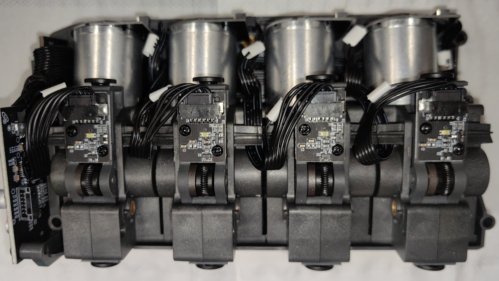
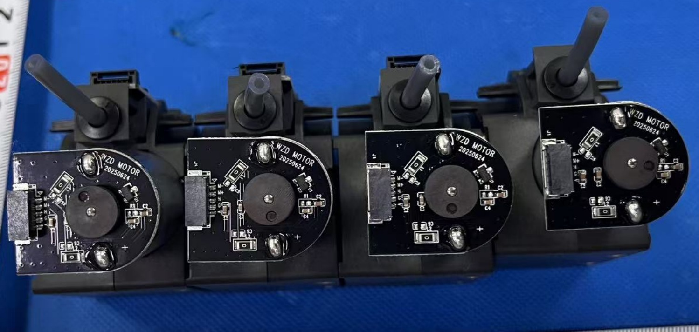
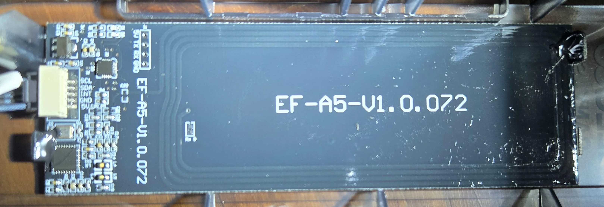
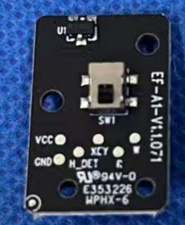
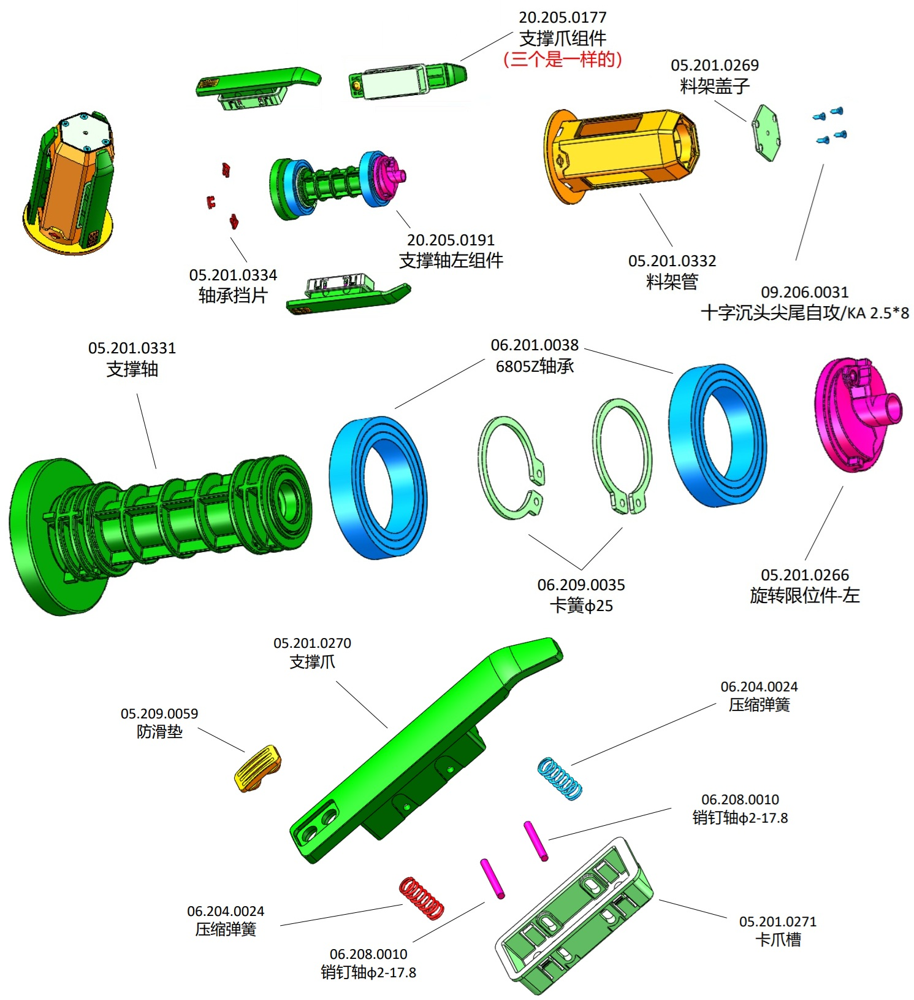
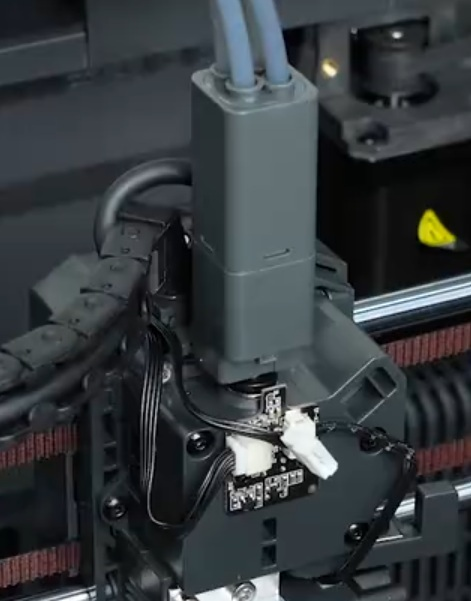
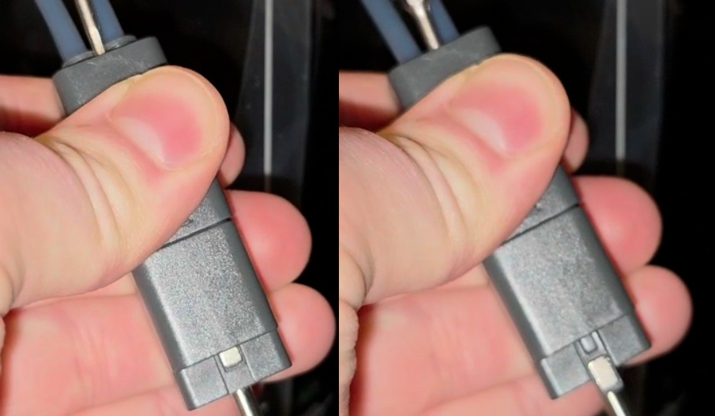
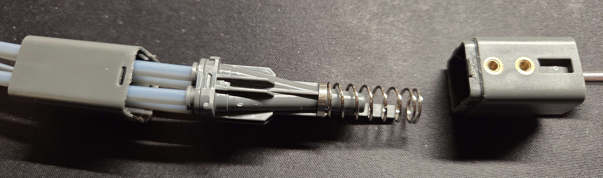
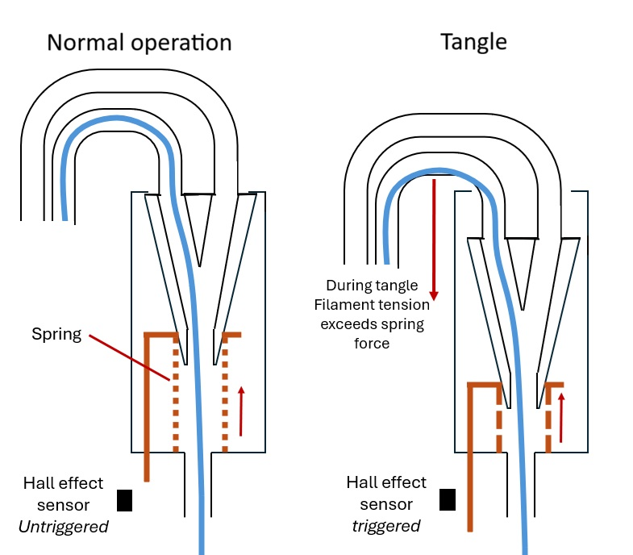

# CANVAS Components

CANVAS is a four-channel multimaterial upgrade module for the Centauri Carbon series. It employs a Type B design based on [Happy-Hare nomenclature](https://github.com/moggieuk/Happy-Hare/wiki/Conceptual-MMU), with a filament multiplexer mounted proximal to the toolhead to minimise retraction distance during material changes. The official manual is available [here](https://raw.githubusercontent.com/OpenCentauri/tools/refs/heads/main/pdf/CC1_canvas_manual_EN.pdf).

The CANVAS module mechanical hardware, spool holders, and multiplexer are shared between CC1 and CC2 variants. The CANVAS mainboard differs between the two units and is documented on the printer-specific pages. Other printer-specific integration details are also on those pages:

- [CC1 CANVAS](../CC1/CANVAS.md)
- [CC2 CANVAS](../CC2/CANVAS.md)

## CANVAS Module

{ width="800" }

The CANVAS core module mounts on the top frame insert of the printer. It superficially resembles the Flashforge IFS system but is internally distinct, using an independent hobbed gear and motor per channel rather than a shared cam-based selector. Four permanent magnet stepper motors drive the four filament channels through worm gearboxes. The motors are produced by Shenzhen Wanzhida Motor Manufacturing Co., Ltd.

{ width="800" }
/// caption
CANVAS internals showing four identical drive channel modules.
///

{ width="800" }
/// caption
CANVAS drive motors.
///

### RFID Board

An RFID reader board is mounted in the front of the CANVAS shell to read filament information from tagged spools. It connects to the rear of the mainboard over I2C. The CC1 and CC2 units use slightly different board revisions.

{ width="800" }
/// caption
CANVAS RFID Board. Credit to u/CalligrapherLoud778 on the Elegoo subreddit.
///

### Filament Detector Boards

One filament detector board is positioned along each channel's filament path. Each board carries a mechanical switch to detect filament presence; the switch is actuated by a spring-loaded bullet-shaped pin that the filament pushes against as it passes. The switch is visible on the rear of each board.

{ width="400" }

## Spool Holders

CANVAS spool holders are secured to the printer frame via two tapped holes in the vertical extrusions. A spring-loaded ratcheting mechanism rewinds filament during unload cycles to prevent tangling. If the holder produces a clicking noise, removing the numbered faceplate and applying a small amount of grease to the ratchet reduces it.

!!! note "CC1"
    The CC1 CANVAS upgrade includes two adapter brackets to compensate for the absence of tapped holes on the CC1 frame. See [CC1 CANVAS](../CC1/CANVAS.md#spool-holders) for details.

{ width="600" }
/// caption
CANVAS spool holder exploded diagram showing internal construction and one half of the ratcheting mechanism (highlighted in pink).
///

## Filament Multiplexer

The filament multiplexer mounts directly to the extruder housing, with a 4 mm OD metal tube at the base replacing the reverse-Bowden PTFE tube. This positioning minimises retraction distance during load and unload cycles.

{ width="400" }
/// caption
Filament multiplexer mounted to the extruder, with the filament detector PCB tab and tangle detection sensor visible in front.
///

Tangle detection is handled by a rear-facing Hall effect sensor at the top of the [Filament Detector PCB](../CC2/toolhead.md#filament-detector-board). Under excessive filament tension a spring-loaded metal tab extends from the multiplexer and activates the sensor, triggering a tangle error.

{ width="600" }
/// caption
Multiplexer tangle detection tab in non-triggered (left) and triggered (right) positions. Credit to laser_velociraptor on the Elegoo Discord.
///

The pneumatic fitting hub is spring-loaded against the top face of the multiplexer housing. When filament tension exceeds the spring force the hub compresses downward, extending the tab into the sensor. The two housing halves are retained by plastic clip features and can be separated by pressing the clips inward to remove jammed filament scraps.

{ width="600" }
/// caption
Multiplexer internals. Credit to laser_velociraptor on the Elegoo Discord.
///

{ width="600" }
/// caption
Multiplexer operation in non-triggered (left) and triggered (right) positions. Credit to baconmilkshake on the OpenCentauri Discord.
///
