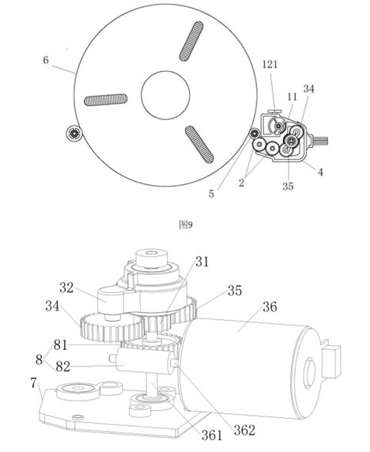
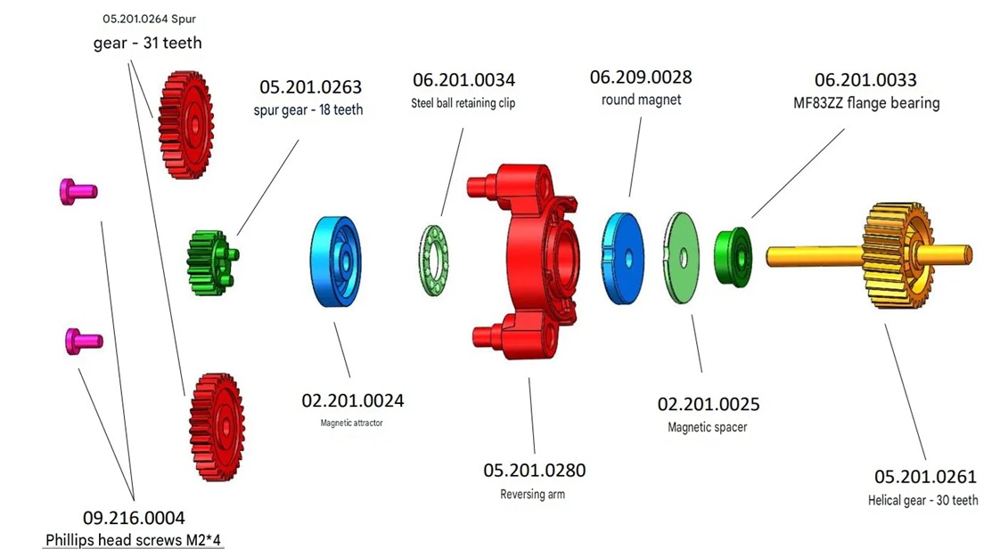
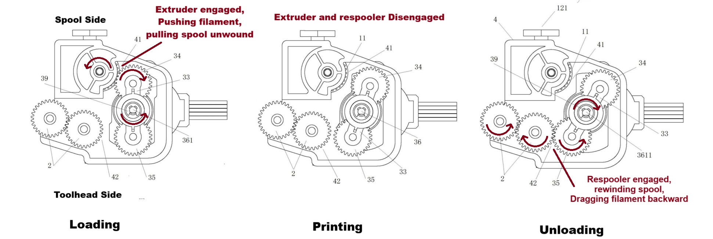
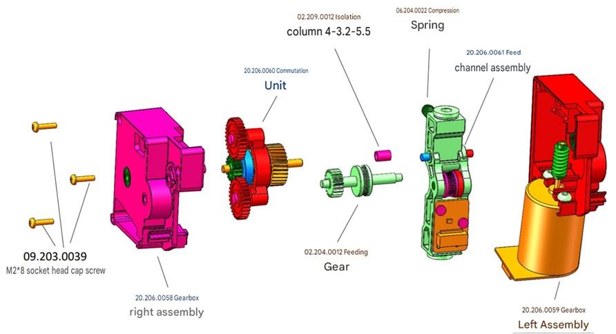

# CANVAS Drivetrain

Each CANVAS channel is a self-contained drive module: one motor, a worm gearbox, and a hobbed gear. There is no shared selector — each channel operates independently. The description below covers a single channel.

The shipped drivetrain is most clearly understood by first examining the earlier design documented in patent [CN120080547A](https://patents.google.com/patent/CN120080547A/en?oq=CN-120080547-A), believed to have been developed for a box-style AMS module briefly visible in the withdrawn CC1 firmware v1.1.42 — see [Unreleased CANVAS Designs](CANVAS_unreleased.md) for details.

## Drivetrain design objective

Each channel motor must perform three distinct operations:

1. **Feed** — push filament forward during load or colour change.
2. **Retract** — pull filament back to clear the shared path for the next channel.
3. **Idle** — disengage entirely so the toolhead extruder can draw filament freely during printing.

The idle requirement is the central design constraint. CANVAS achieves passive disengagement without additional active components such as solenoids or servos.

!!! note "Why idle requires a clutch"
    Both designs use a worm gear reduction, which is non-backdrivable: load on the output cannot back-drive the worm. If the feed gear were permanently coupled to the worm, the toolhead extruder could not pull filament through a parked channel. A disengaging clutch is therefore required.

## Patent design (CN120080547A)

The patent documents the core mechanical concept: a magnetically-clutched reversing arm that selects between gear positions through motor direction alone.

{ width="800" }
/// caption
Patent CN120080547A showing the early CANVAS drivetrain with an active spool rewinding gear train not present in the shipped design.
///

### Reversing arm

The reversing arm is a small pivoting bar that couples the worm-driven input gear to the feed gear. A circular magnet and steel-ball thrust bearing sit between the arm and the input, forming a magnetic clutch. This combination of a reversible slip drive with a magnetic coupling is the core IP of the patent. The physical construction is most clearly visible in the Elegoo BOM for the shipped design rather than the patent drawings.

{ width="800" }
/// caption
Reversing arm assembly from the shipped CANVAS design. Circular magnet, steel-ball thrust bearing, worm-driven helical input gear, and driven spur gears at both ends of the arm.
///

The coupling serves two functions simultaneously:

- **Actuation** — motor torque creates magnetic drag that swings the arm until its gear jams into mesh.
- **Slip clutch** — once the arm reaches its mechanical stop, the magnet slips against the spinning input, providing overload protection while maintaining drive.

!!! tip "Steel-ball thrust bearing"
    The thrust bearing holds the magnetic gap at a fixed distance, keeping coupling torque and slip threshold consistent as parts wear.

### Three arm positions

The patent design uses three arm positions, each engaging a dedicated gear:

- **Feed/Loading** — the feed gear is engaged; filament is pushed toward the toolhead. The spool pays out freely.
- **Neutral/Printing** — both ends are disengaged. The toolhead can draw filament freely.
- **Retract/Unload** — the spool-drive gear is engaged; filament is wound back onto the reel. The feed gear is idle.

{ width="800" }
/// caption
The three gear positions from left to right: loading, printing/neutral, and unloading. Red arrows indicate gear rotation direction. Adapted from patent CN120080547A. Credit to baconmilkshake on the OpenCentauri Discord.
///

## Shipped design

The shipped CANVAS removed the active spool drive entirely. Spool holders are mounted on the printer frame with passive spring re-winders, and retraction distances are short because the multiplexer sits on the toolhead. With the dedicated spool-drive gear eliminated, the arm's second engagement position was repurposed: the arm swings fully back past neutral and re-engages the same feed gear from the opposite side, driving it in reverse for retraction. Neutral is entered by a brief motor reversal at the end of each load or unload cycle, which swings the arm back to the disengaged position.

{ width="800" }

| Arm position | Motor direction | Feed gear | Result |
|---|---|---|---|
| **Neutral** | Parked | Disengaged | Toolhead draws filament freely |
| **Feed** | Forward | Engaged forward | Filament pushed toward toolhead; spool pays out |
| **Retract** | Reverse | Engaged reverse | Filament pulled back; passive spring spool retracts |

### Why the arm carries two gears

The arm carries a driven gear at each end. When the motor turns, the arm is dragged in that direction until the leading gear jams into mesh. Reversing the motor direction swings the arm the other way, bringing the opposite gear into mesh from the other side. A single gear could only be pressed into mesh in one direction; the two gears allow the same feed gear to be driven in both forward and reverse.

In the patent design the two arm ends drove different outputs (feed gear and spool gear). In the shipped CANVAS both ends reach the same feed gear from opposite angles.

## Neutral retention

Neutral is maintained by commanding the motor to a defined park angle and stopping. The magnetic coupling holds the arm in rotational alignment as a magnetic detent. In neutral both arm gears are fully out of mesh, so filament drawn by the toolhead imposes no load on the arm. The slip behaviour is relevant only during active feed and retract, where it acts as overload protection.
