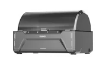

# Unreleased CANVAS Designs

Firmware analysis of the withdrawn CC1 firmware v1.1.42 revealed references to two unreleased multimaterial module variants distinct from the shipped CANVAS. The modules appear to share the "Multi Color Factory" internal designation. Both appear to be 4-spool designs.

{ width="500" }
/// caption
Icon for the unreleased box-style AMS module, found in withdrawn CC1 firmware v1.1.42. Credit to suchmememanyskill on the OpenCentauri Discord.
///

!!! warning "Speculative"
    The information on this page is derived from firmware strings and binary analysis. Component lists and feature assignments are inferred, not confirmed by Elegoo.

## Multi Color Factory Standard

The Standard variant is a [Type B MMU](https://github.com/moggieuk/Happy-Hare/wiki/Conceptual-MMU) — each channel has an independent drive motor, with a multiplexer near the toolhead handling filament routing. This matches the architecture of the shipped CANVAS and is broadly comparable to the Qidi Box, which uses the same per-channel independent drive approach in a similar box-style enclosure. The Standard variant adds active drying (PTC heaters and NTC sensors) not present on either the shipped CANVAS or the Qidi Box.

| Component | Details |
|---|---|
| Heating elements | 2× PTC |
| Temperature sensors | 2× NTC |
| RFID readers | 2× FM17550 (or one reader with two antennas) |
| Stepper motors | 4× with TMC2209 drivers |
| Multiplexer IC | HC4067 |

The use of TMC2209 drivers rather than the lower-cost TMC2208 is notable. TMC2209 adds StallGuard and UART configuration; this may simply be standardization of the trinamic driver selection across the Centauri series but the StallGuard capability may be intended for load/unload failures. The drivetrain of the Standard variant may be covered by patent [CN120038936A](https://worldwide.espacenet.com/patent/search?q=pn%3DCN120038936A).

## Multi Color Factory Lite

The Lite variant is a [Type A MMU](https://github.com/moggieuk/Happy-Hare/wiki/Conceptual-MMU) — a single shared drive mechanism selects between channels using a cam-based rotary selector, rather than independent per-channel motors. This architecture is directly comparable to the Anycubic Ace Pro, which similarly uses two motors (one for the rotary selector, one for the common drive wheel) and Hall effect sensors for selector position detection across four channels. Despite the superficial similarity of the shipped CANVAS system to similarities to other Lite style AMS systems the Multi Color Factory Lite design is distinct from the type B MMU system of the shipped system which is more closely related to that documented in patent [CN120080547A](https://patents.google.com/patent/CN120080547A/en?oq=CN-120080547-A).

| Component | Details |
|---|---|
| Stepper motors | 2× with DRV8833 drivers |
| Motor supply voltage | 9V |
| Stepper function | Likely one drive wheel motor and one CAM selector motor |
| Position sensing | Hall effect sensors (CAM position detection) |
| RFID | Present |
| LED | Present |
| Display | Possible (firmware hints) |
| Buzzer | Present |

## Source

Firmware analysis by Suchmememanyskill on the OpenCentauri Discord.
