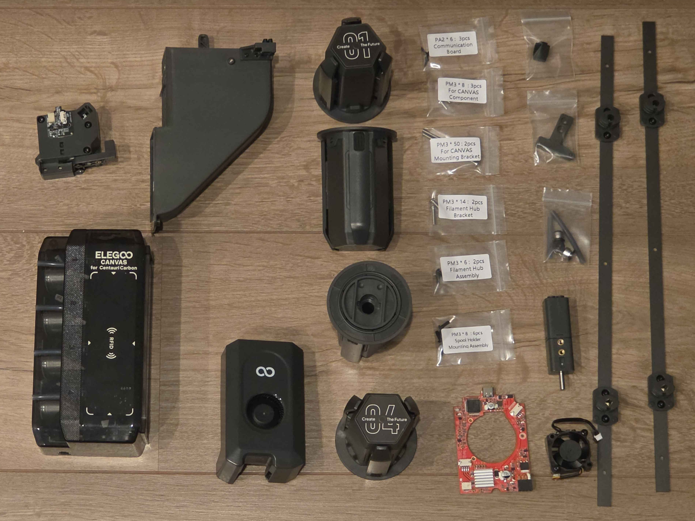
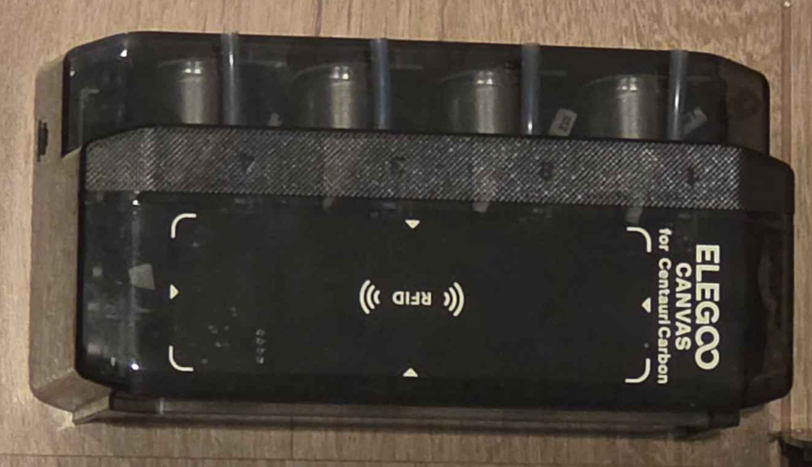
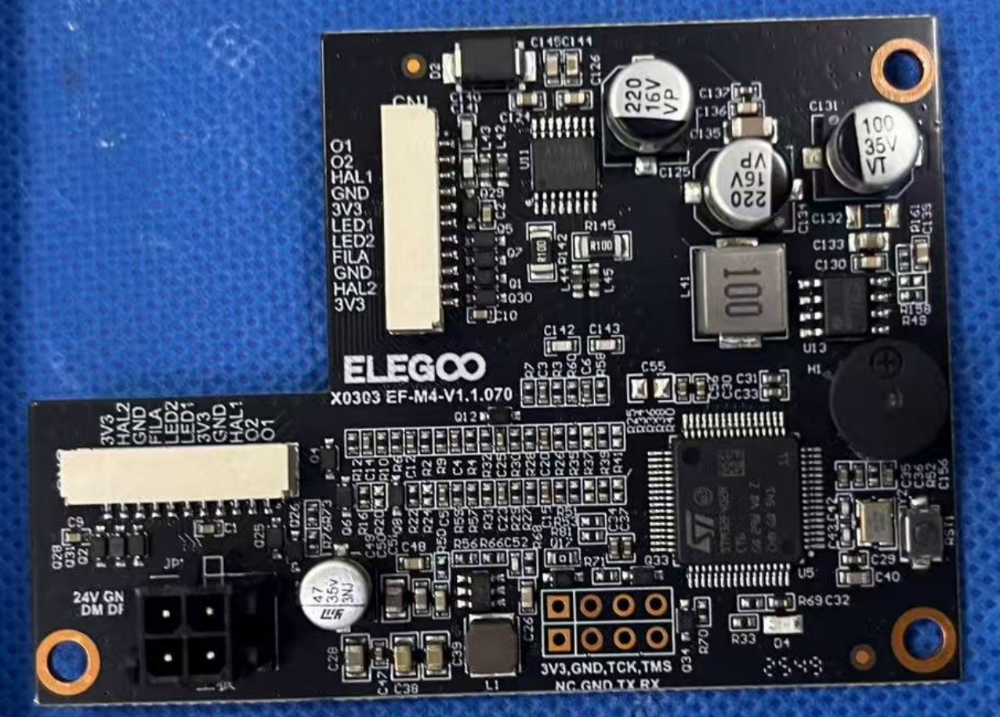
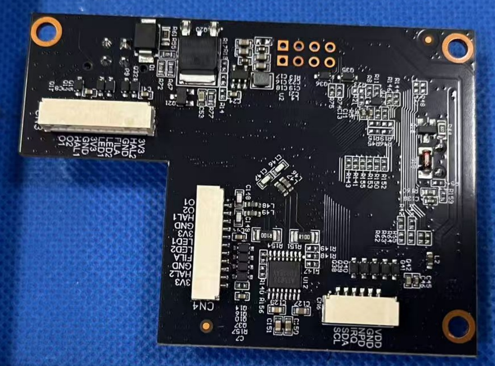
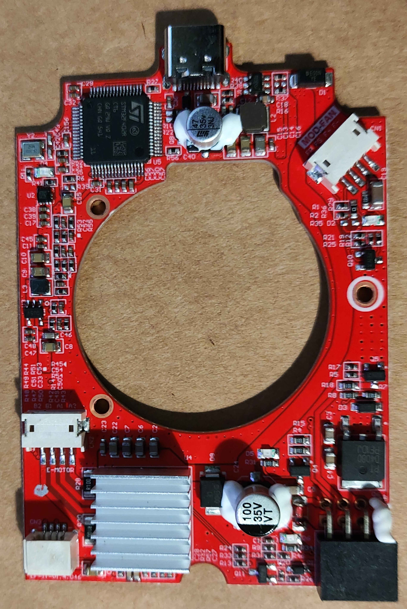
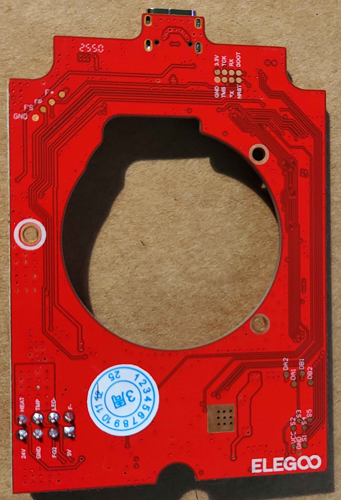
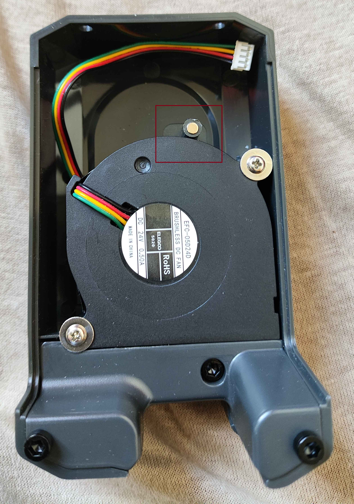

# CC1 CANVAS

CANVAS is a multimaterial upgrade kit for the CC1. The CANVAS module hardware is shared with the CC2; shared documentation is on the [CANVAS General](../CANVAS/CANVAS_components.md) page. This page covers CC1-specific integration differences.

The official manual is available [here](https://raw.githubusercontent.com/OpenCentauri/tools/refs/heads/main/pdf/CC1_canvas_manual_EN.pdf).

{ width="800" }
/// caption
Contents of a CC1 CANVAS upgrade kit, excluding cables. A top cover is not included.
///

## CANVAS Module

{ width="800" }
/// caption
Credit to anna_devminer on the OpenCentauri Discord.
///

The CANVAS core module mounts on the top frame insert of the CC1. It is mechanically identical to the CC2 CANVAS but uses a different mainboard revision and a slightly different [RFID board revision](../CANVAS/CANVAS_components.md#rfid-board).

### CANVAS Mainboard

Metric|Value
---|---
MCU|GD32F303RCT6
Vendor Id|
Product Id|
Device BCD|
Product|
Manufacturer|GigaDevice Semicon Beijing
Stepper driver|4× AT8833 (DRV8833 clone)

Front|Back
---|---
{ width="800" }|{ width="800" }

## Spool Holders

The CC2 spool holders are reused. Two adapter brackets are supplied to compensate for the absence of additional tapped holes on the CC1 frame (visible in the kit contents image above). See [CANVAS General — Spool Holders](../CANVAS/CANVAS_components.md#spool-holders) for full details.

## Filament Multiplexer

An identical filament multiplexer to the CC2 is supplied. See [CANVAS General — Filament Multiplexer](../CANVAS/CANVAS_components.md#filament-multiplexer) for full details.

## Revised Toolhead Board

A new toolhead PCB is included to support the filament cutter actuator Hall effect sensor, front cover removal Hall effect sensor, and filament detector. This board is distinct from both the original CC1 toolhead board and the CC2 board. It retains the populated LED MOSFET for toolhead lighting, unlike the CC2. The original CC1 breakout board for the thermistor, heater, and hotend fan is reused.

Front|Back
---|---
{ width="800" }|{ width="800" }
/// caption
CC1 CANVAS toolhead board. Credit to anna_devminer on the OpenCentauri Discord.
///

### Toolhead Board MCU

Metric|Value
---|---
MCU|STM32F402RCT6
USB Spec|v1.0 (full-speed)
Vendor Id|1d50
Product Id|614e
Device BCD|2.00
Product|STM32 Virtual ComPort
Manufacturer|ShenZhenCBD
Stepper driver|TMC2209

## Extruder Upgrade with Filament Detector

A CC2 extruder with filament detector board is included in the upgrade kit. The same board revision is used [as on the CC2](../CC2/toolhead.md#filament-detector-board).

## Revised Front Cover and Hotend Fan Assembly

A new hotend fan duct and fan are provided, with a Hall effect sensor for filament cutter actuation detection. This assembly is identical to the [corresponding CC2 part](../CC2/toolhead.md#filament-cutter-actuation-sensor).

A new toolhead cover is also provided. The filament detector board's forward-facing Hall effect sensor detects cover removal via a magnet in the cover, as [on the CC2](../CC2/toolhead.md#filament-detector-board). The fan supplied is a standard CC1 5020, not the [integrated custom fan used on the CC2](../CC2/toolhead.md#hardware).

{ width="800" }
/// caption
Revised toolhead cover. The magnet location is indicated by the red box. Credit to anna_devminer on the OpenCentauri Discord.
///
