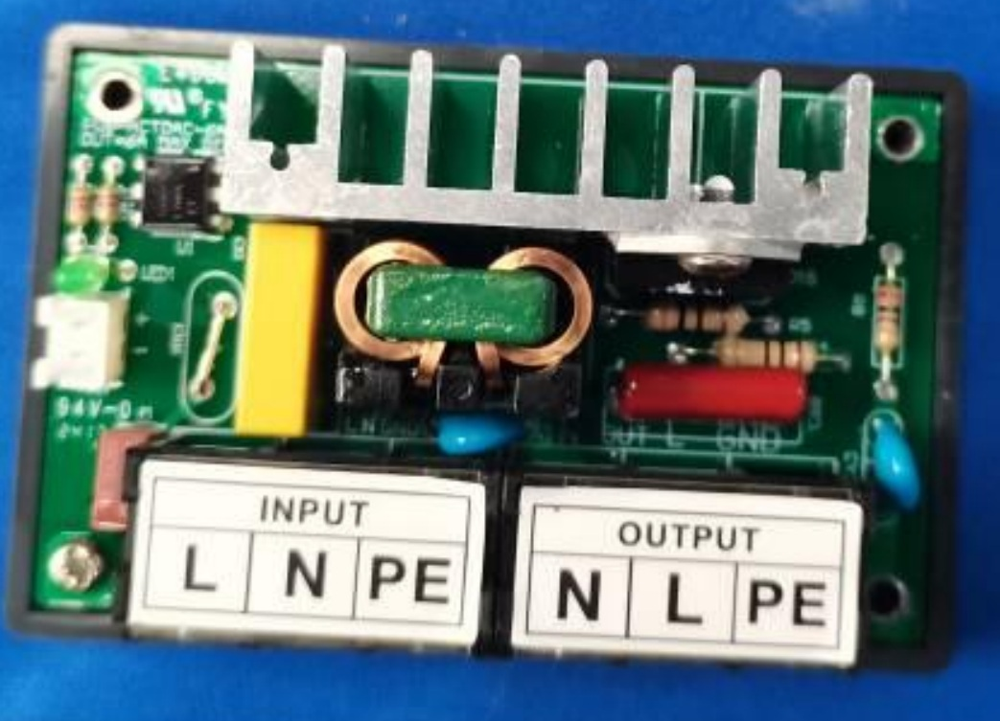
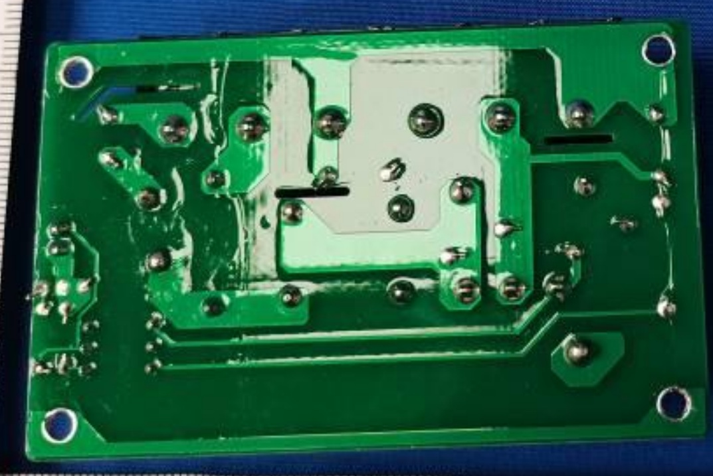
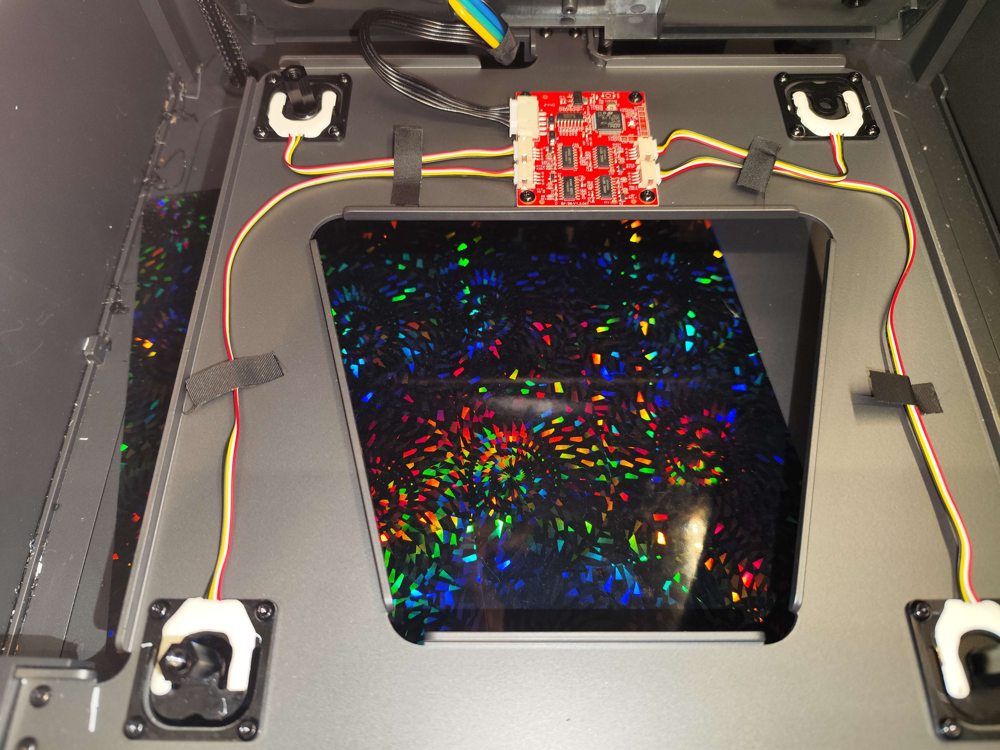
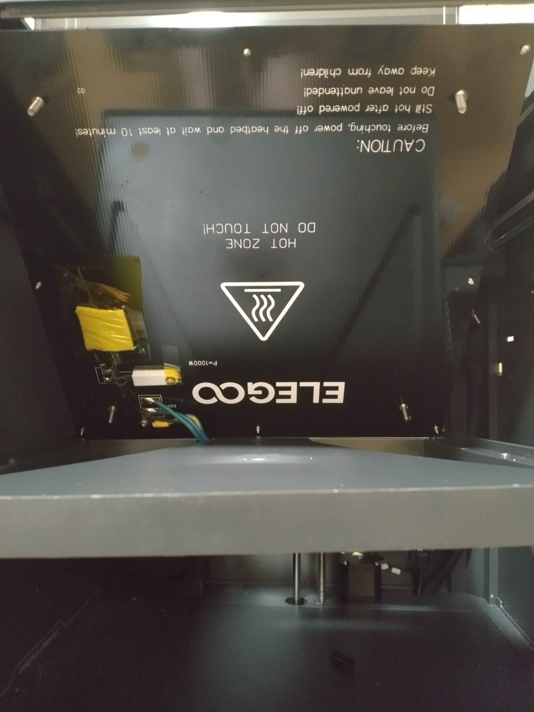
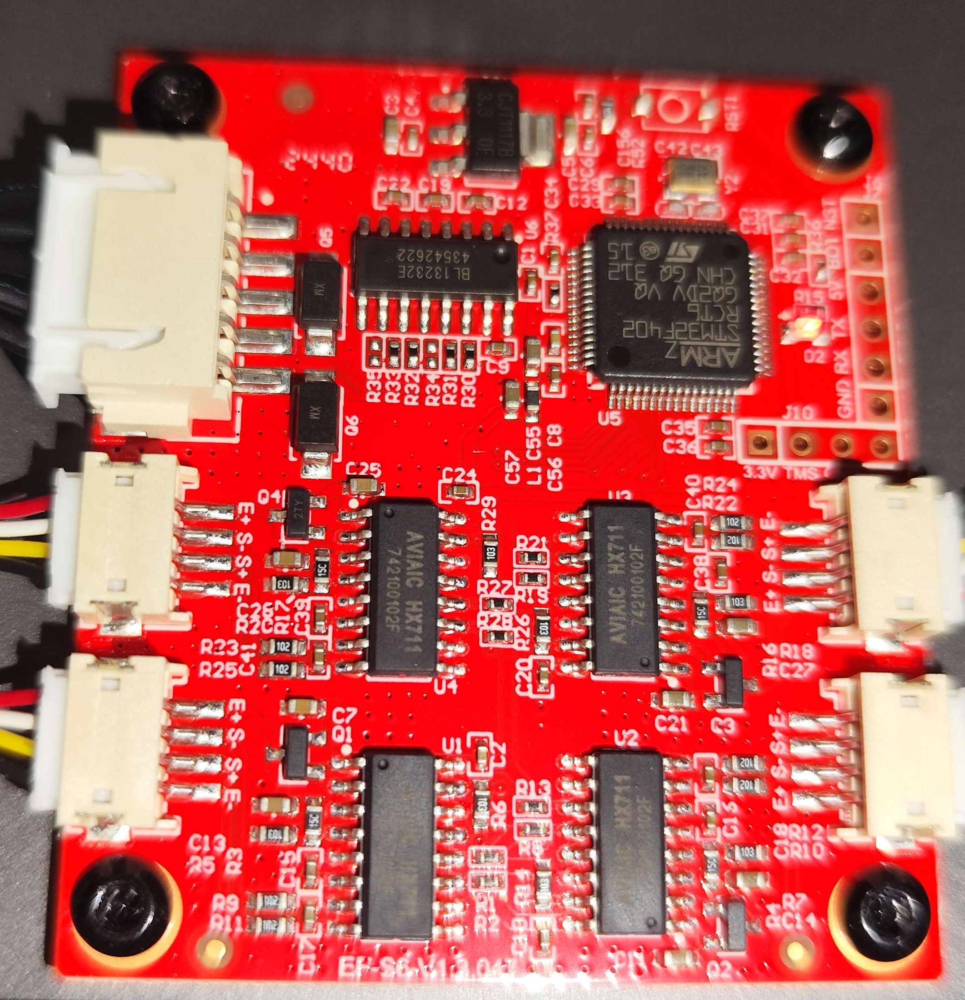
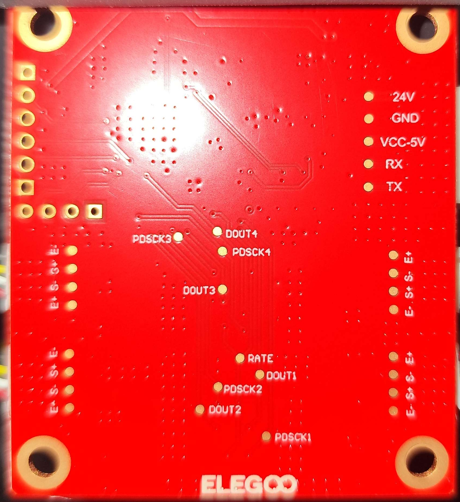

# CC1 Bed

!!! Danger
    The Bed runs on mains AC current at 110/220 V. **These voltages may be lethal.** Exercise extreme caution around the bed and SSR board.

## Bed Heating SSR Board

The CC1 uses a solid state relay (SSR) board to control the mains bed heating.

Front|Back
---|---
{ width="525" }|{ width="600" }

## Bed Leveling Board
{ width="600" }
/// caption
Credit to rabirx on the OpenCentauri Discord.
///

{ width="600" }
/// caption
Credit to baconmilkshake on the OpenCentauri Discord.
///

Front|Back
---|---
{ width="800" }|{ width="800" }
Credit to rabirx on the OpenCentauri Discord.|Credit to rabirx on the OpenCentauri Discord.

The bed is its own Klipper MCU with an accelerometer and some pressure sensors.

The bed leveling board connects with serial (not over USB) to the mainboard.

## MCU

Metric|Value
---|---
MCU|STM32F402RCT6
Vendor Id|1d50
Product Id|614e
Device BCD|2.00
Product|STM32 Virtual ComPort
Manufacturer|ShenZhenCBD

## Hardware
Metric|Value
---|---
Resistance|~48.4Ω
Operating Voltage| 220V/110V
Power|1000W (220V)/250W (110V)
Safety mechanisms|Gnd Present, Thermal Fuse
Thermistor type|NTC100K
Thickness|3mm aluminum plate, 1.5mm magnetic sheet
Strain gauge|4 wire Wheatstone bridge
Strain gauge amplifier|HX711