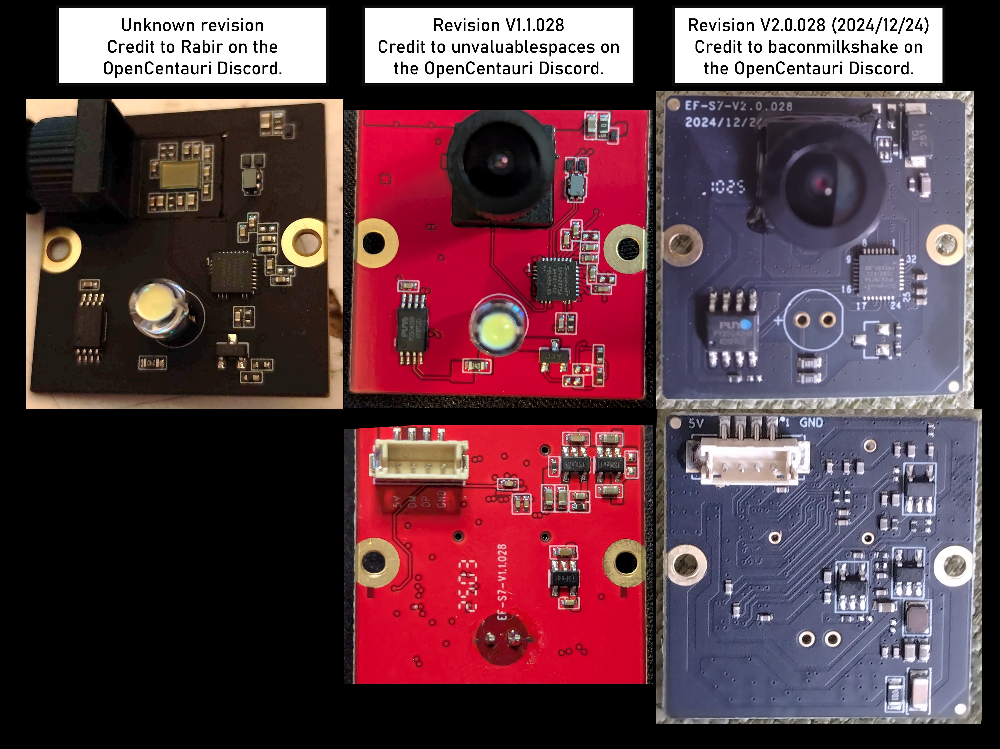
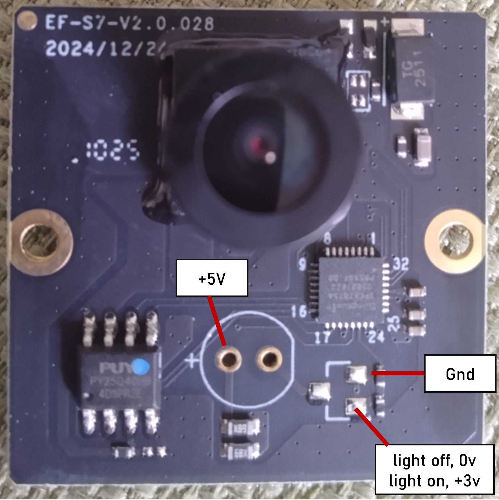
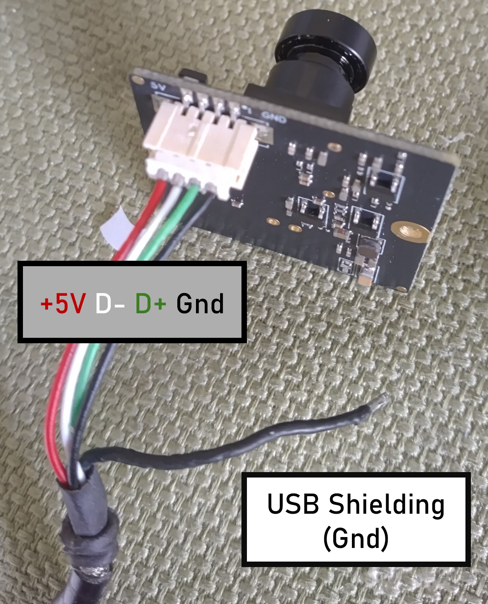

# CC1 Camera

Metric|Value
---|---
Resolution|720p(1280x720)
Aspect Ratio|16:9
Max Refresh Rate|30 Hz
Focus|Fixed (glued barrel adjustment)
FOV|90-110°?
Exposure|Auto
PCB Dimensions|30mmx30mm
Connector|4 pin JST-ZH (1.5mm pitch)
Communication Protocol|USB 2.0
Display Name|"Integrated Camera"
Listed Power|500 mA @5V
USB Transceiver|SunplusIT SPCA2075A
Flash|PUYA P25D40SH or PY25Q128HB

## Camera Revisions
At least three revisions of the Centauri Carbon camera PCB exist. The most recent
version (V2.0.028) is included in units that shipped with 24 LED strip lighting
and lack the LED on the camera and associated YP3 surface mount transistor. However
the pin for LED control is still active. Testing shows when the chamber lights are
turned on the pad for the transistor gate changes from 0 to +3V.

{ width="800" }
/// caption
Credit to Rabir, unvaluablespaces, and baconmilkshake on the OpenCentauri Discord.
///

{ width="350" }
/// caption
Camera LED control on a V2.0.028 board lacking an LED and switching transistor
 showing switching transistor pads are still functional.
Credit to baconmilkshake on the OpenCentauri Discord.
///

## Camera Pins

Pin|Value
---|---
1/GND| GND
2/DP| D+
3/DN| D-
4/5V| +5v

{ width="350" }
/// caption
Camera shown attached to a USB cable for a PC webcam with standard color coded
USB wires. The second ground connector is for USB cable shielding and is not necessary.
Credit to baconmilkshake on the OpenCentauri Discord.
///

## Camera Replacement

See [Camera Replacement](../../mods/camera_mods.md) in the Mods section for information on replacing the stock camera with aftermarket USB cameras.
