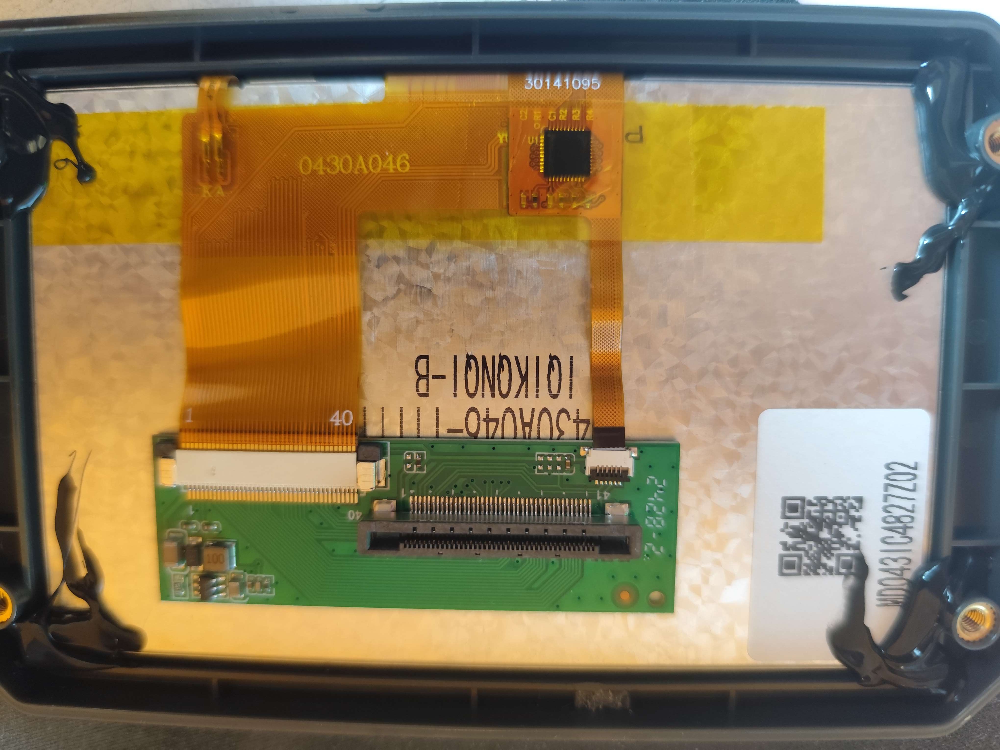
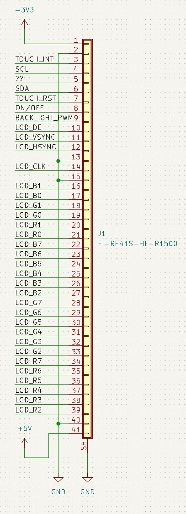
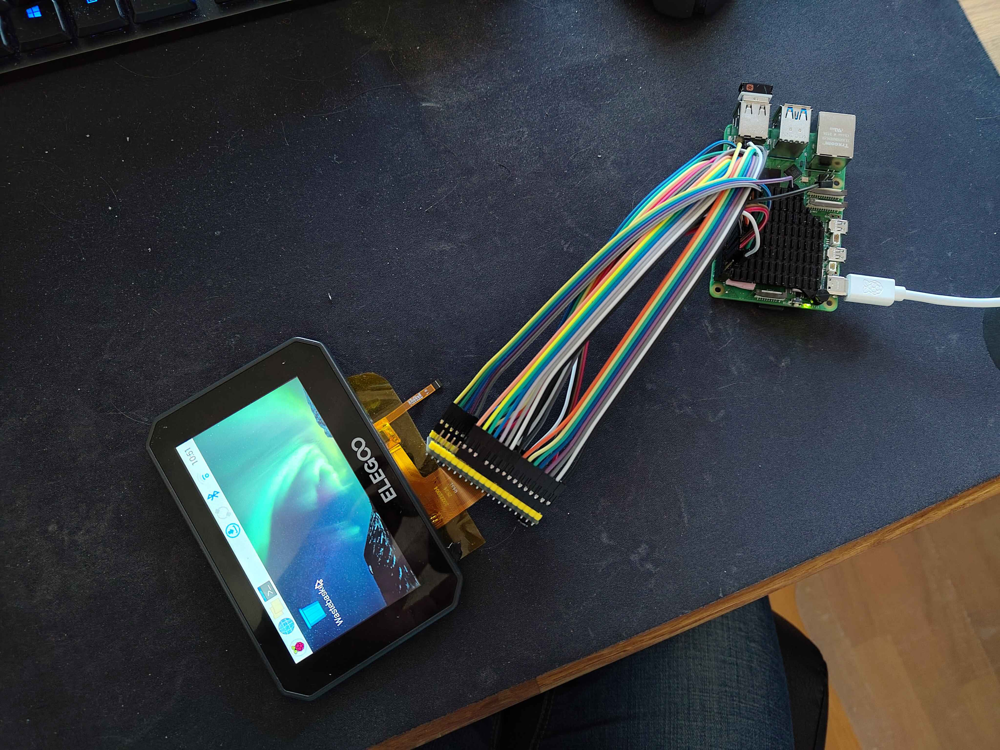

# CC1 Screen

{ width="600" }
/// caption
Credit to rabirx on the OpenCentauri Discord.
///

The screen is a generic `0430A046-I1I1100` LCD screen (capacitive touch screen version). The display is driven directly by the Alwinner SOC. The actual LCD and digitizer are connected to the PCB mounted b by a 40 pin TFT flexible printed circuit (FPC) and a six pin touch FPC. The rear PCB adapts both to a 41 pin flexible flat cable (FFC) that carries both touch and display information to the mainboard. It can be connected to other devices (with great difficulty) using a standard TFT adapter and appropriate GPIO pins as seen below.

{ width="600" }
/// caption
40 pin FPC pinout from the raw display panel. Credit to Jamesturton on the OpenCentauri Discord.
///

{ width="600" }
/// caption
CC1 display functioning with a Raspberry Pi by means of a 40 pin TFT breakout board. Credit to Jamesturton on the OpenCentauri Discord.
///