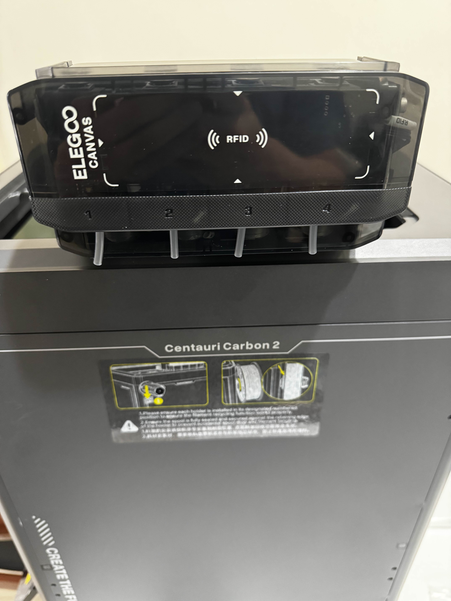
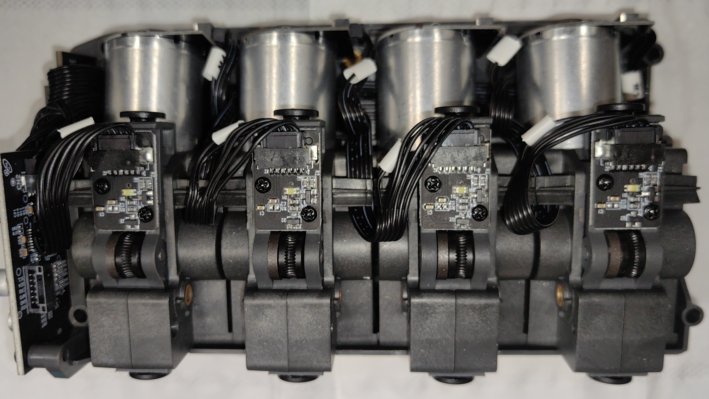

## Overview

CANVAS is a multimaterial/multicolor module for the Centauri Carbon 2. It employs a Type B design based on [Happy-Hare nomenclature](https://github.com/moggieuk/Happy-Hare/wiki/Conceptual-MMU) with a filament multiplexer proximal to the toolhead for minimal retraction distance.

## CANVAS Module

{ width="800" }
/// caption
Credit to keefe826 on the OpenCentauri Discord.
///

The CANVAS core module mounts on the top frame insert of the CC2 alongside the tophat. The system superficially resembles the Flashforge IFS system but is internally distinct and uses independent hobbed gears and motors rather than a cam-based selector. Four permanent magnet stepper motors or DC motors are used to control filament channels, likely combined with worm gearing. Filament detector boards are sent along the filament path for each channel and appear to use Hall effect sensors similarly to the IFS

It is equipped with an RFID reader to read filament information

{ width="800" }
/// caption
Credit to keefe826 on the OpenCentauri Discord.
///

## Spool Holders

## Filament Multiplexer

