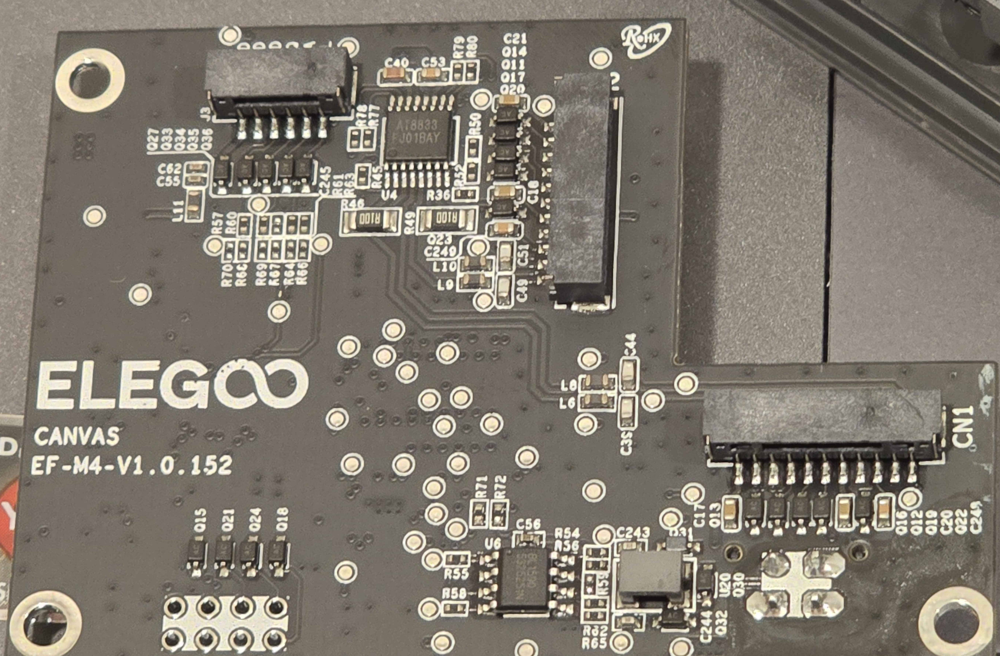

# CC2 CANVAS

CANVAS is the multimaterial upgrade module for the CC2. Shared hardware documentation — module internals, RFID board, filament detector boards, spool holders, and the filament multiplexer — is on the [CANVAS General](../CANVAS/CANVAS_components.md) page.

## CANVAS Module

{ width="800" }
/// caption
Credit to keefe826 on the OpenCentauri Discord.
///

The CANVAS core module mounts on the top frame insert of the CC2 alongside the tophat.

### CANVAS Mainboard

Metric|Value
---|---
MCU|GD32F303RCT6
Vendor Id|
Product Id|
Device BCD|
Product|
Manufacturer|GigaDevice Semicon Beijing
Stepper driver|4× AT8833 (DRV8833 clone)

Front|Back
---|---
{ width="800" }|{ width="800" }
/// caption
Credit to Savion on the OpenCentauri Discord.
///

{ width="800" }
/// caption
CANVAS internals.
///
