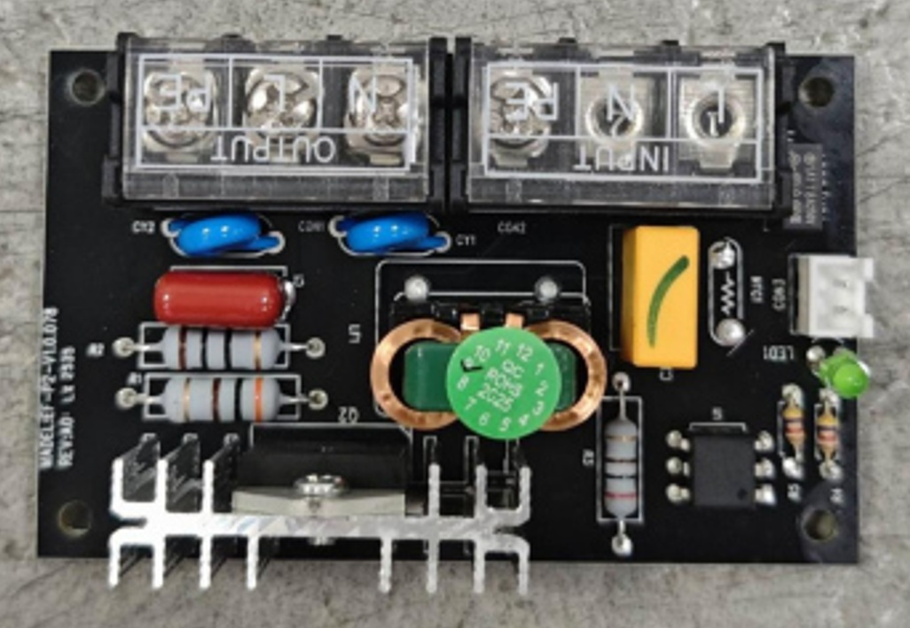
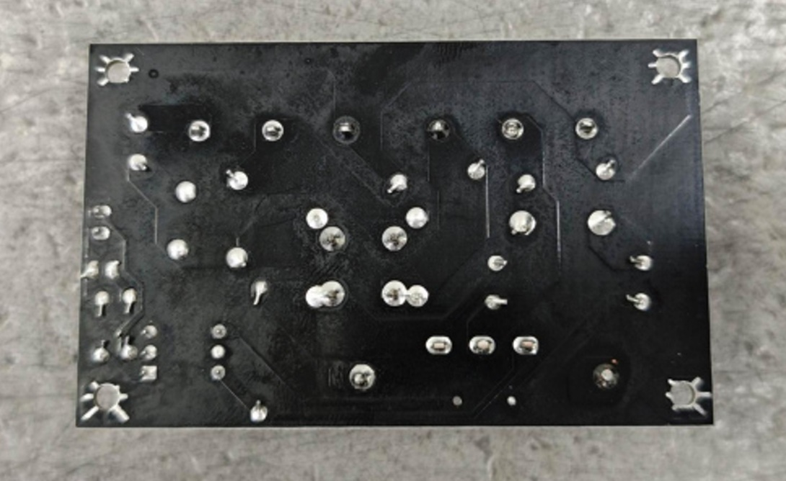
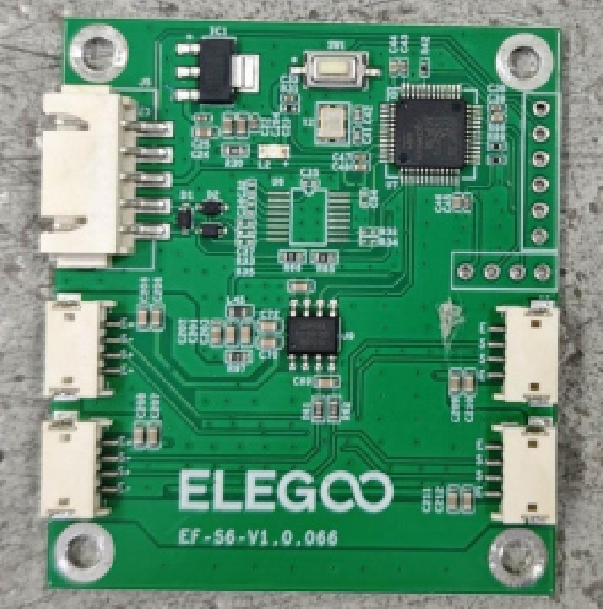
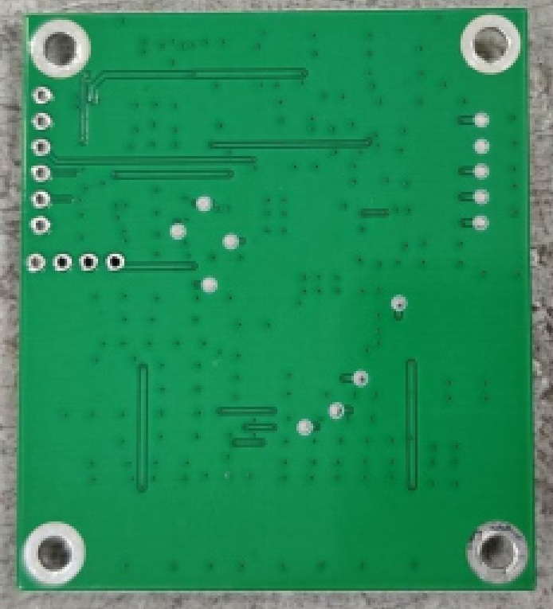

# CC2 Bed

!!! Danger
    The Bed runs on mains AC current at 110/220 V. **These voltages may be lethal.** Exercise extreme caution around the bed and SSR board.

## Bed Heating SSR Board

[Like the CC1](../CC1/bed.md/#bed-heating-ssr-board) the CC2 uses a solid state relay (SSR) board to control the mains bed heating.

Front|Back
---|---
{ width="525" }|{ width="600" }

## Bed Leveling Board
Front|Back
---|---
{ width="550" }|{ width="500" }

The bed is its own Klipper MCU and some pressure sensors [similar on the CC1](../CC1/bed.md/#bed-leveling-board). However on the CC2 board does not use four discrete HX711 amplifiers for strain gauge polling as on the CC1 but instead has a single amplifier IC. 

## Bed MCU

Metric|Value
---|---
MCU|STM32F402RCT6
Vendor Id|
Product Id|
Device BCD|
Product|
Manufacturer|

## Hardware
Metric|Value
---|---
Resistance|~48.4Ω
Operating Voltage| 220V/110V
Power|1000W (220V)/250W (110V)
Safety mechanisms|Gnd Present, Thermal Fuse
Thermistor type|NTC100K
Thickness|3mm aluminum plate, 1.5mm magnetic sheet
Strain gauge|4 wire Wheatstone bridge
Strain gauge amplifier|