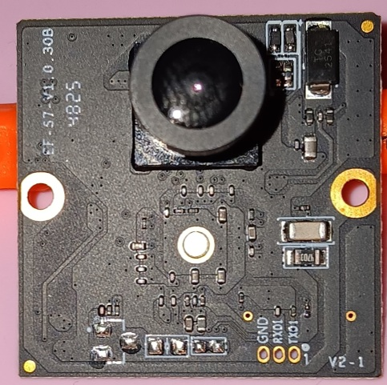
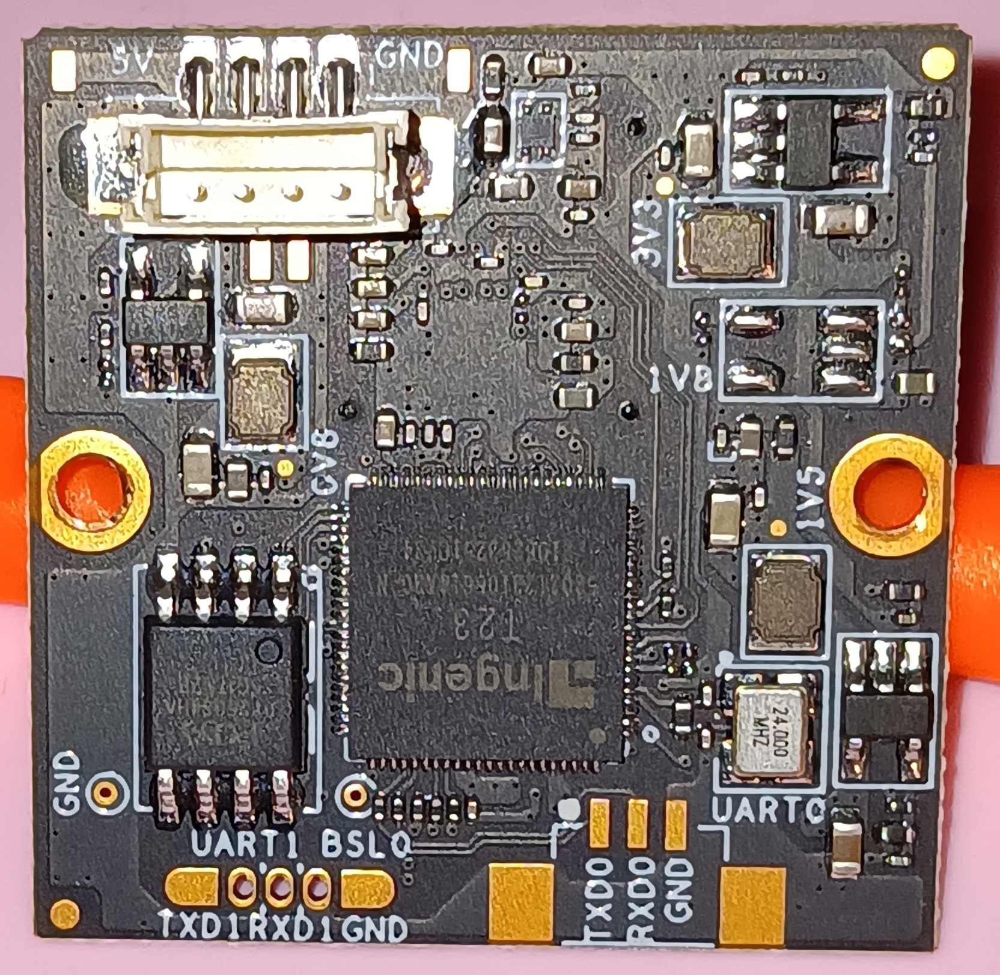

# CC2 Camera

The CC2 camera is slightly different, but unremarkable from, the various CC1 camera revisions.

Metric|Value
---|---
Resolution|720p(1280x720)
Aspect Ratio|16:9
Max Refresh Rate|30 Hz
Focus|Fixed (glued barrel adjustment)
FOV|90-110°?
Exposure|Auto
PCB Dimensions|30mmx30mm
Connector|4 pin JST-ZH (1.5mm pitch)
Communication Protocol|USB 2.0
Display Name|"Integrated Camera"
Listed Power|500 mA @5Vs
USB Transceiver|
Flash|

Front|Back
---|---
{ width="800" }|{ width="800" }
/// caption
Credit to chiaia on the OpenCentauri Discord.
///

## Camera Pins

Pin|Value
---|---
1/GND| GND
2/DP| D+
3/DN| D-
4/5V| +5v
