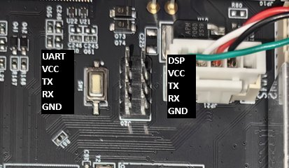
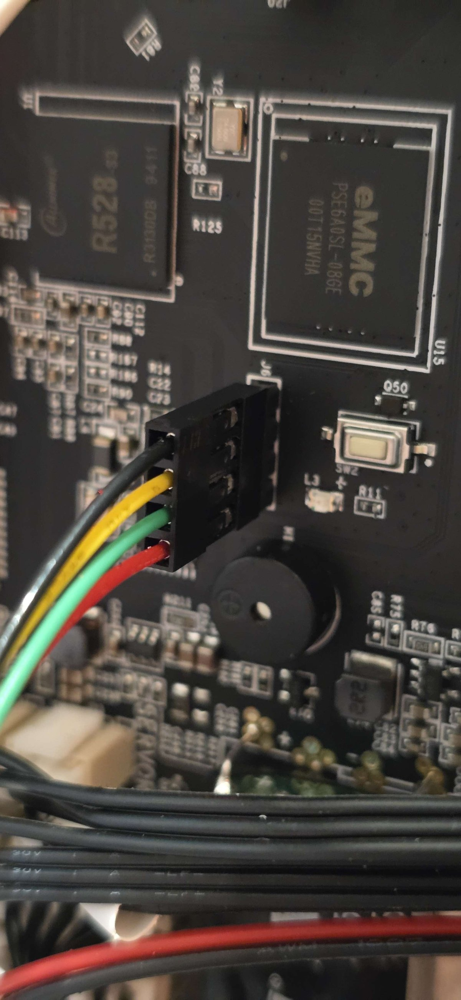

# CC2 FEL & UART Bench Setup

This guide describes how to set up a Centauri Carbon 2 mainboard on a bench for FEL access/eMMC recovery and UART access to u-Boot and Linux.

!!! info
    This setup is useful for:

    - Accessing FEL mode for eMMC recovery
    - Serial console access to u-Boot and Linux
    - Advanced debugging and development work

!!! note "Differences from the CC1"
    The CC2 uses the same Allwinner R528/T113 SoC as the CC1, so the wiring and FEL/UART workflow are nearly identical. Two hardware differences matter:

    - **No usable USB-C port.** The CC1's USB-C FEL options (modified cable / power blocker) don't exist here — the CC2's external "USB-C-shaped" connector is a **2-pin 24V power terminal, not USB**. On the CC2 you reach the FEL USB lines through the **FEL header (J6)** instead.
    - **No R53 resistor to short.** You enter FEL with the onboard **buttons** (SW1/SW2), not by shorting a resistor.

## Hardware Requirements

You will need the following components:

- **24V Power Supply**
- **3.3V USB Serial UART Dongle** (e.g., [Amazon Link](https://a.co/d/0fSMDXwf))
    - *Alternative:* A Raspberry Pi or ESP32 acting as a serial interface
    - Dupont jumper cables for the UART wiring are often included with the dongle
- **FEL USB Connection** — a **USB-A male to dupont female cable** wired to the board's **FEL header (J6)**. Unlike the CC1 there is no USB-C port to use, so this header is the only FEL entry point. (Sold pre-assembled as "USB to dupont" / "USB to 4-pin" — e.g., [Amazon Link](https://www.amazon.com/dp/B09ZFKFPHS) — or solder one from a sacrificial USB-A cable.)

## Critical Warnings

!!! danger "VOLTAGE DANGER"
    The CC2's external **USB-C-shaped connector is a 2-pin 24V power terminal, not USB.** Do **not** plug a USB device into it — you will destroy whatever you connect. Use the **FEL header (J6)** for the USB/FEL connection.

!!! warning "Safety Precautions"
    - **Ground Continuity:** Ensure continuity of Ground between all peripherals
    - **Loose Wires:** If a 24V power/ground wire comes loose, it can cause power to flow across the UART, which **will destroy one or more board chips**
    - **Power Sequencing:** **Do not** plug or unplug components (even the USB) while anything is powered up. Insert the USB and USB-UART connections while the board is **powered down**

## Step-by-Step Hookup

!!! important
    Complete all steps with the power supply **disconnected**. Only apply power after all connections are securely in place.

### 1. Power Connection

Connect the **24V VCC** and **Ground** wires to your external power supply.

See the **24V Input** tab on the [mainboard pinout](mainboard.md) page for the exact pin locations.

### 2. UART Connection

Connect the **3.3V Serial UART Tx, Rx, and Ground** between the CC2 **UART0** header and your serial interface (USB dongle, Pi, etc.).

**Pin Connections:**

- TX (Transmit from board) → RX on your serial adapter
- RX (Receive to board) → TX on your serial adapter
- GND → GND

!!! important
    Do not connect the VCC (5V) pin on the UART header.

UART0 is the **lower** 4-pin row of the 2×4 UART0/DSP header (the upper row is the DSP console). See the **UART0/DSP** tab on the [mainboard pinout](mainboard.md) page for the exact pin locations.

{ width="500" }

### 3. FEL / USB Connection

The CC2 has no USB-C port for FEL — connect through the **FEL header (J6)** using a **USB-A male to dupont female cable**.

Wire the FEL header to the USB-A plug as follows:

| FEL header (J6) | Marking | USB-A pin | Wire (typical) |
|---|---|---|---|
| 1 (closest to eMMC) | GND | 4 (GND) | black |
| 2 | DP | 3 (D+) | green |
| 3 | DM | 2 (D−) | white |
| 4 (farthest) | 5V | 1 (VBUS / +5V) | red |

!!! warning
    **DP and DM are swapped compared to a standard USB-A pinout.** Don't build a straight-through cable — follow the table above. See the **FEL** tab on the [mainboard pinout](mainboard.md) page.

{ width="320" }

### 4. Entering FEL Mode

The CC2 has **no R53 resistor to short** (unlike the CC1) — FEL is entered with the onboard buttons:

1. With the USB and UART connected and the board powered, **press and hold SW2** (the FEL/boot button, next to J6).
2. While holding SW2, **press and release SW1** (reset, next to the UART0 header).
3. Keep SW2 held ~2 seconds, then release.

Your PC should enumerate the FEL device (USB ID `1F3A` `EFE8`). On Windows you'll need to install the WinUSB driver.

For installing the WinUSB driver and the `sunxi-fel` tool, see [§2 — Install tools](https://github.com/OpenCentauri/cc-fw-tools/blob/main/docs/EMMC_BACKUP_RESTORE_CC2.md#2-install-tools) in the CC2 eMMC backup/restore guide.

## Related Documentation

- [CC2 Mainboard Pinout](mainboard.md) — 24V input, UART0/DSP, and FEL header pin details
- [CC2 eMMC Backup / Restore](https://github.com/OpenCentauri/cc-fw-tools/blob/main/docs/EMMC_BACKUP_RESTORE_CC2.md) — full step-by-step backup and restore procedure (cc-fw-tools)
