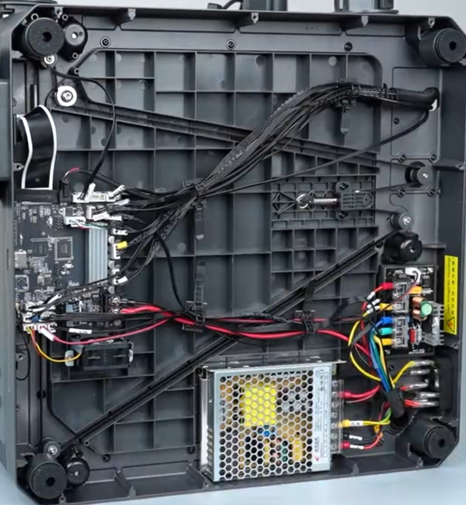

# CC2 Hardware

-   Centauri Carbon 2 Printer specifications:
    
    Metric|Value
    ---|---
    Print area size|256 mm^3
    Hotend|350 °C All-Metal
    Heatbed|110 °C AC-powered
    Max power usage|1100W@220V, 350W@110V
    Weight|17.65kg
    Machine size|398x404x490mm
    /// caption
    CC2 model and FDM-optimized replacement parts available through the [OpenCentauri CAD repository](https://github.com/OpenCentauri/cad)
    ///

-   <iframe src="https://smith150.autodesk360.com/shares/public/SH90d2dQT28d5b602811459ab32956791734?mode=embed" width="800" height="600" allowfullscreen="true" webkitallowfullscreen="true" mozallowfullscreen="true" frameborder="0"></iframe>

{ width="800" }