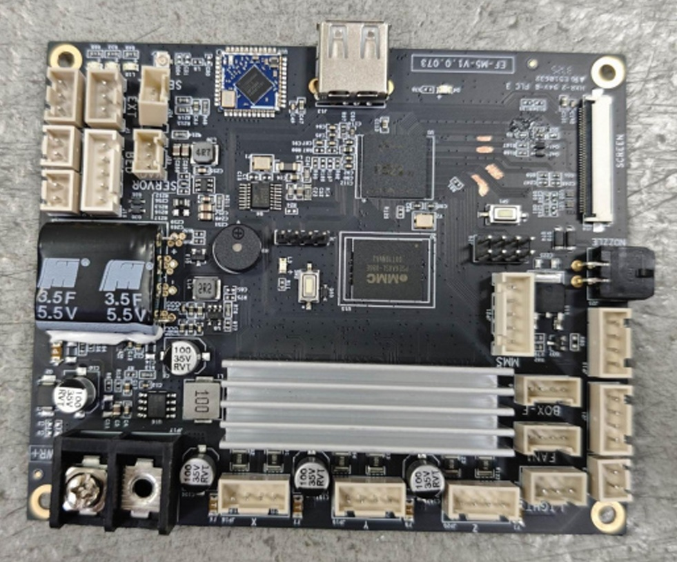
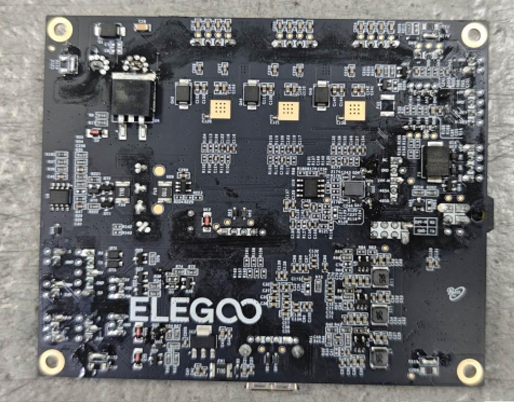
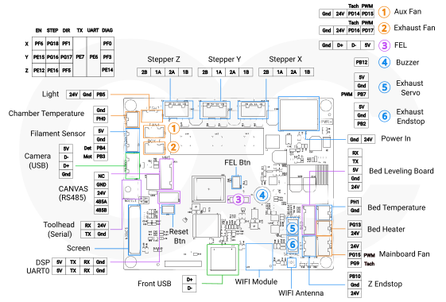

# CC2 Mainboard

Metric|Value
---|---
SoC|AllWinner R528-S3
Memory|128 MB in-chip
Storage|8gb eMMC
Stepper drivers|TMC2209
Part Number|EF-M5-V1.0.073

Front|Back
---|---
{ width="800" }|{ width="800" }
Credit to Thijskunst on the OpenCentauri Discord.|Credit to Thijskunst on the OpenCentauri Discord.

## Mainboard Pins

{ width="1600" }
/// caption
Credit to Savion and Baconmilkshake on the OpenCentauri Discord.
///

=== "24V Input"
    Type: 2-Pin Barrier terminal with 9.6mm pin pitch

    |pin nr|marking|Function|remarks|
    |--|---|----|---|
    |1| - | GND |Closest to the stepper connectors|
    |1| + | +24V |Do not overtighten as it is very flimsy|

=== "Steppers X,Y,Z"
    Type: JST-**XHB**-4P

    |pin nr|marking|Function|remarks|
    |--|---|----|---|
    |1| 2B|2B||
    |2| 1A|1A||
    |3| 2A|2A||
    |4| 1B|1B||

=== "Filament Sensor"
    Type: JST-**XHB**-4P

    |pin nr|marking|pin|remarks|
    |--|---|----|---|
    |3| M-DET | PB3 |Filament presence/absence|
    |3| S-DET | PB4 |Filament motion detection|
    |2| GND | GND ||
    |1| +5V | +5V ||

=== "Chamber Temp (BOX-T)"
    Type: JST-**XHB**-2P

    |pin nr|marking|pin|remarks|
    |--|---|----|---|
    |1| S | PH0 |standard NTC100k B3950|
    |2| GND | GND ||

=== "Light"
    Type: JST-**XHB**-3P

    |pin nr|marking|pin|remarks|
    |--|---|----|---|
    |1| +24V | +24V | Max 1A |
    |2| GND | GND ||
    |2| S | PB5 ||

=== "Side Fan (FAN-1)"
    Type: JST-**XHB**-4P

    |pin nr|marking|pin|remarks|
    |--|---|----|---|
    |1| GND | GND ||
    |2| +24V | +24V ||
    |3| FS-A | PD14 | Tachometer |
    |4| FP-A | PD15 | PWM |

=== "Exhaust Fan (BOX-F)"
    Type: JST-**XHB**-4P

    |pin nr|marking|pin|remarks|
    |--|---|----|---|
    |1| GND | GND ||
    |2| +24V | +24V ||
    |3| FS-B | PD16 | Tachometer |
    |4| FP-B | PD17 | PWM |

=== "Exhaust Servo"
    Type: JST-**XHB**-3P

    |pin nr|marking|pin|remarks|
    |--|---|----|---|
    |1| PWM | PB2 ||
    |2| GND | GND ||
    |3| 5V | 5V | Servo control signal|

=== "Exhaust Endstrop"
    Type: JST-**XHB**-3P

    |pin nr|marking|pin|remarks|
    |--|---|----|---|
    |1| S | PB7 ||
    |2| GND | GND ||
    |3| 5V | 5V ||

=== "Camera"
    Type: JST-**XHB**-4P

    |pin nr|marking|pin|remarks|
    |--|---|----|---|
    |1| GND | GND | regular usb port but with a JST connector|
    |2| DP | USB-DP ||
    |3| DM | USB-DM ||
    |4| 5v | +5V ||

=== "UART0/DSP"
    Type: 2x4-Pin 2.54mm pin header

    Upper 4-Pin Header: DSP

    |pin nr|marking|pin|remarks|
    |--|---|----|---|
    |1|  | +5V ||
    |2|  | TX ||
    |3|  | RX ||
    |4|  | GND ||

    Lower 4-Pin Header: UART0

    |pin nr|marking|pin|remarks|
    |--|---|----|---|
    |1|  | +5V ||
    |2|  | TX ||
    |3|  | RX ||
    |4|  | GND ||

=== "FEL"
    4-Pin Header:

    |pin nr|marking|pin|remarks|
    |--|---|----|---|
    |1| | GND ||
    |2| | DP |
    |3| | DM |
    |4| | 5V ||

=== "CANVAS"
    Type: JST-**XHB**-5P
    External port: AMS port 2x2 Micro-Fit 3.0

    |pin nr|marking|pin|remarks|
    |--|---|----|---|
    |1| 485B | RS485-A | |
    |2| 485A | RS485-B | |
    |3| 24V  | +24V | 24v for motors inside the MMU|
    |4| GND | GND ||
    |5| NC | +5V ||

=== "Toolhead Board Connection"
    Type: 2x2 Micro-Fit 3.0
    Toolhead side port: USB-C (USB 2.0 only)

    !!! warning
        Do not plug in anything other than the extruder board. This type-C connector has 24V VCC instead of 5V. Anything you plug in WILL GET FRIED!!

    |pin nr|marking|pin|remarks|
    |--|---|----|---|
    |1 |GND | GND  | upper portion of connector, screen side|
    |2 |24V | **24V!** Vbus | upper portion of connector camera side|
    |3 |TX | TX | lower portion of connector screen side |
    |4 |RX | RX | lower portion of connector camera side |

=== "Display"
    Type: xx Pin FFC

    RGB888 display + touch\
    ``unknown pinout``

=== "Front USB"
    Type: USB-A

    |pin nr|marking|pin|remarks|
    |--|---|----|---|
    |1| GND | GND | regular usb-A port|
    |2| DP | DP ||
    |3| DM | DM ||
    |4| 5v | +5V ||

=== "Z-Endstop (EXT)"
    Type: JST-**XHB**-3P

    |pin nr|marking|pin|remarks|
    |--|---|----|---|
    |1| 24V | +24V||
    |2| - | GND||
    |3| S | PB10 |3.3V pullup, LOW/0v when bed is not in sensor|

=== "Mainboard Fan (BFAN)"
    Type: JST-**XHB**-3P

    |pin nr|marking|pin|remarks|
    |--|---|----|---|
    |1| 24V | +24V ||
    |2| GND | PG16 | GND_PWM, Controlled by MCU|
    |3| S | PG6 | Tachometer |

=== "Bed MCU (RS-232)"
    Type: JST-**XHB**-5P

    |pin nr|marking|pin|remarks|
    |--|---|----|---|
    |1| 24V | +24V | Not used on the leveling mcu board|
    |2| GND | GND |
    |3| 5V | +5V | 5v is switched to reset the bed MCU |
    |4| TX | TX||
    |5| RX | RX||

=== "Bed Heater (HBED)"
    Type: JST-**XHB**-2P

    |pin nr|marking|pin|remarks|
    |--|---|----|---|
    |1| PWM | PG13 | GND_PWM, Controlled by MCU|
    |2| 24V | +24V||

=== "Bed Temp Sensor (BED-T)"
    Type: JST-**XHB**-2P

    |pin nr|marking|pin|remarks|
    |--|---|----|---|
    |1| S | PB14 |  NTC100k B3950|
    |2| - | GND ||

=== "Buzzer"
    Type: Onboard piezoelectric buzzer

    |pin nr|marking|pin|remarks|
    |--|---|----|---|
    |1|  | PB12 | Piezo buzzer for filament runout alert|

