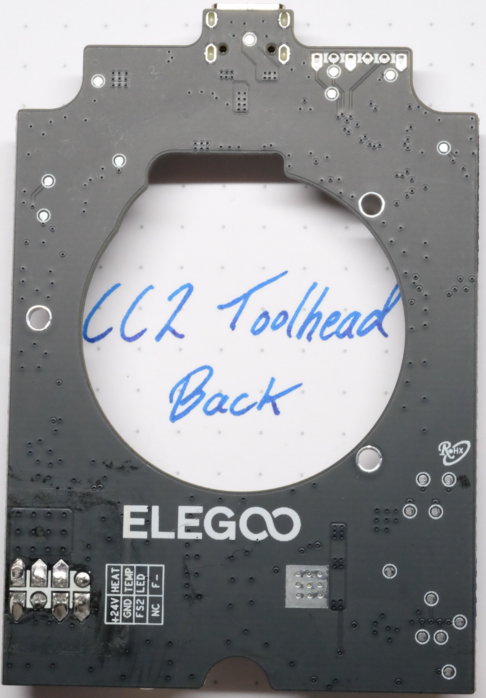
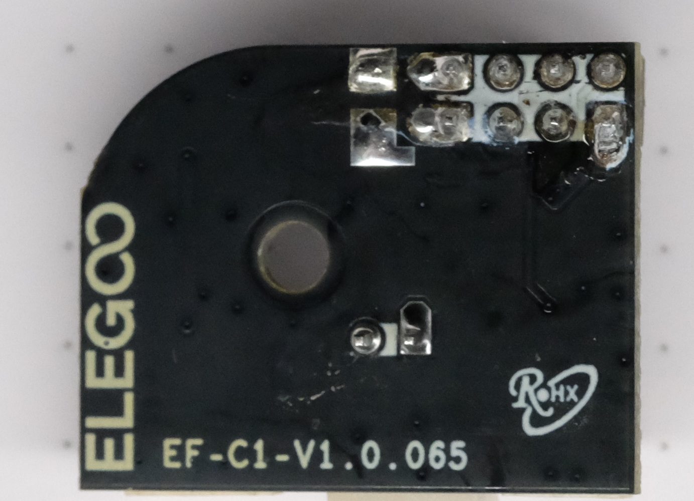
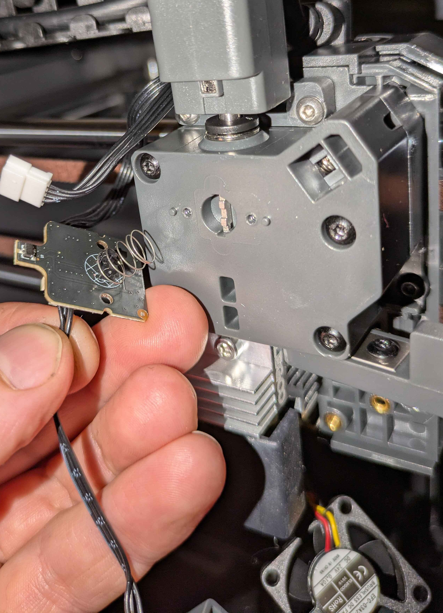
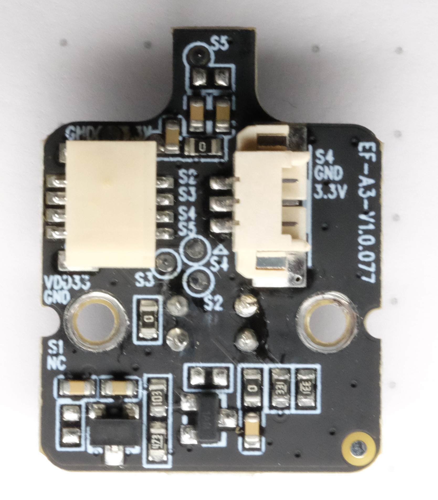
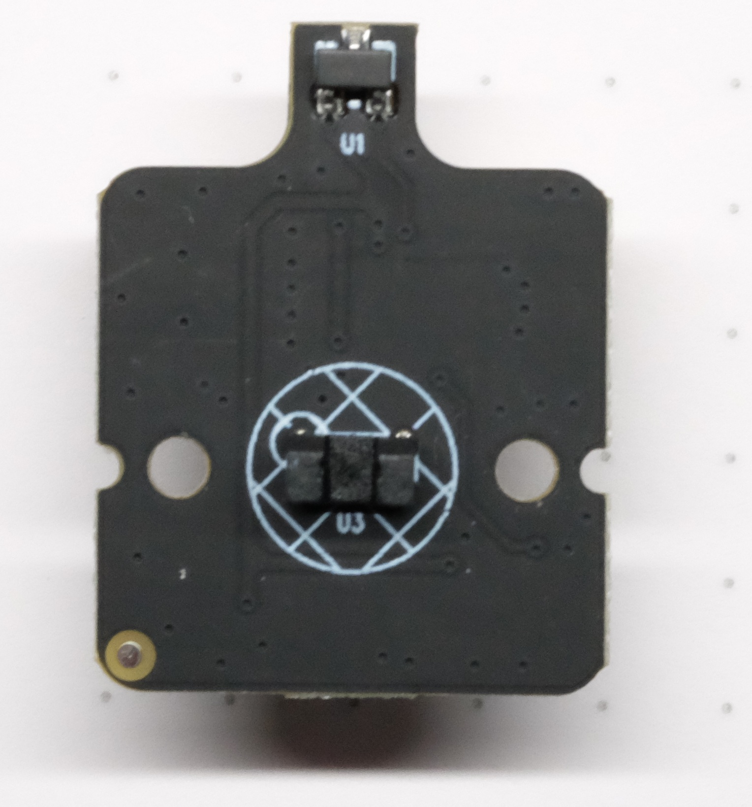
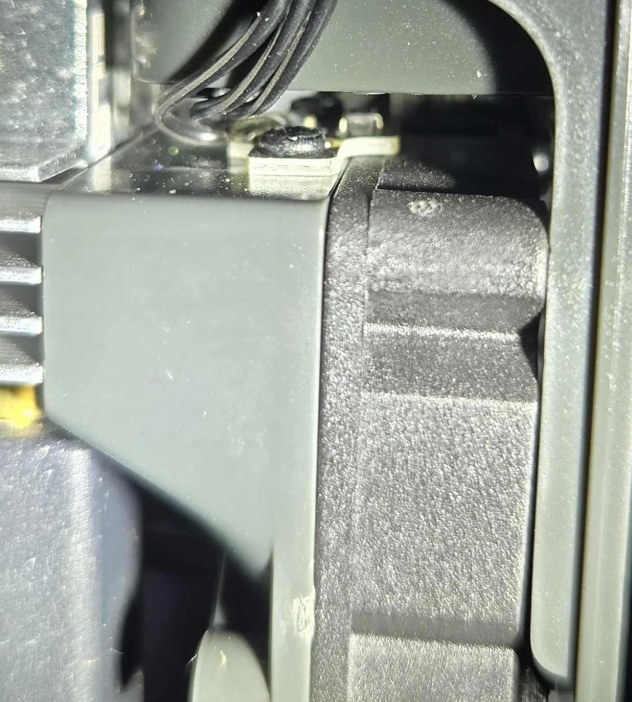
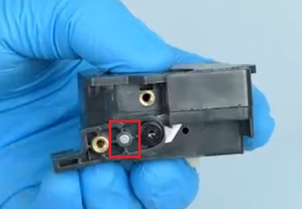
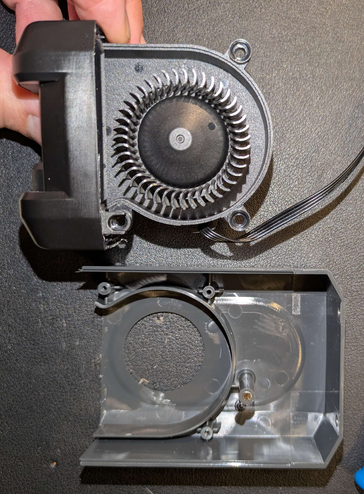

# CC2 Toolhead

Front|Back
---|---
{ width="800" }|{ width="800" }
Credit to keefe826 on the OpenCentauri Discord.|Credit to toreg0977 on the OpenCentauri Discord.

The toolhead board is connected over a USB-C cable. Unlike the CC1, serial is used instead of USB protocol for communication. The toolhead board receives 24V power.

## Supplementary board

Front|Back
---|---
{ width="600" }|{ width="600" }
Marked `EF-C1-V1.0.065`. Credit to toreg0977 on the OpenCentauri Discord.|Credit to toreg0977 on the OpenCentauri Discord.

The Toolhead board has a 2x4 pin port at the bottom. This connector links to a separate PCB that breaks out the required hotend connectors (temperature sensor, heater, and hotend fan).

## Toolhead Board Pins

{ width="1000" }
/// caption
Credit to Baconmilkshake on the OpenCentauri Discord.
///

=== "Toolhead USB (24V)"
    Type: USB-C, carries 24V Vbus

    |pin nr|marking|pin|remarks|
    |--|---|----|---|
    |1| D+ | USB D+ ||
    |2| D- | USB D- ||

=== "Part Cooling Fan"
    Type: 4-Pin connector

    |pin nr|marking|pin|remarks|
    |--|---|----|---|
    |1| Tach | PA8 ||
    |2| PWM | PB15 ||
    |3| 24V | +24V ||
    |4| Gnd | GND ||

=== "LIS2DW12 (SPI1)"
    Onboard accelerometer test points

    |marking|pin|
    |---|---|
    |CS|PA4|
    |SCLK|PA5|
    |MOSI|PA7|
    |MISO|PA6|

=== "Stepper E"
    Type: 4-Pin connector (motor coil)

    |pin nr|marking|remarks|
    |--|---|---|
    |1| 2B ||
    |2| 1A ||
    |3| 2A ||
    |4| 1B ||

    Driver control test points:

    |marking|pin|
    |---|---|
    |EN|PB7|
    |STEP|PB5|
    |DIR|PB6|
    |UART|PB11|

=== "Filament Detector Board"
    Type: 4-Pin connector, connects to the [filament detector board](#filament-detector-board)

    |pin nr|marking|pin|remarks|
    |--|---|----|---|
    |1| S5 | PA1 | Top row, tangle detection|
    |2| S4 | PA2 | Top row, [cutter actuation sensor](#filament-cutter-actuation-sensor)|
    |3| S3 | PA0 | Top row, Model detection- purpose unknown|
    |4| S2 | PB1 | Top row, optical filament detect|
    |5| NC || Bottom row|
    |6| S1 | PB0 | Bottom row, toolhead cover detection|
    |7| Gnd | GND | Bottom row|
    |8| 3V3 | +3.3V | Bottom row|

=== "Supplementary Board"
    Type: 8-Pin connector (2x4), connects to [supplementary board](#supplementary-board)

    |pin nr|marking|pin|remarks|
    |--|---|----|---|
    |1| FP | PB13 | Hotend fan PWM|
    |2| LED- | ~ | LED PWM, not connected|
    |3| Temp | PA3 | Top row|
    |4| Heat | PB8 | Top row|
    |5| F+ | +24V | Bottom row, also LED+|
    |6| FS | PB14 | Hotend fan tach, 24v|
    |7| F- | GND | Bottom row|
    |8| F+ | +24V | Bottom row|

## Filament Detector Board

The CC2 has an additional filament detector board connected to the bottom port on the opposite side of the supplementary board pins. It uses an optical sensor to detect filament entry into the extruder. A spring on the back of the board retains a lever that blocks the optical sensor when filament enters the extruder. A redesigned front and rear extruder shell accommodate both this detector board and the filament [multiplexer](../CANVAS/CANVAS_components.md#filament-multiplexer).

This board also includes forward- and rear-facing Hall effect sensors. The forward sensor, located near the middle of the board, detects the toolhead cover using a small magnet in the CC2 toolhead. The rear sensor, located near the top-back side of the board and extending over the multiplexer, is used for tangle detection. A spring-loaded tab in the multiplexer extends under filament tension and triggers this sensor once tension exceeds a threshold.

{ width="800" }
/// caption
Credit to keefe826 on the OpenCentauri Discord.
///

{ width="600" }
/// caption
Back side of detector board showing filament actuation lever, optical sensor, and multiplexer sensor. Credit to sune2573 on the OpenCentauri Discord.
///

{ width="600" }
/// caption
Filament detector board annotated with hall effect-based cover detection. Credit to keefe826 on the OpenCentauri Discord.
///

Front|Back
---|---
{ width="600" }|{ width="600" }
Connector side, marked `EF-A3-V1.0.077`. Credit to toreg0977 on the OpenCentauri Discord.|Sensor side, showing the tangle detection hall sensor (`U1`) on the rear tab and the filament detector optical sensor (`U3`) mid-board. Credit to toreg0977 on the OpenCentauri Discord.

## Filament cutter actuation sensor

A small board screwed into the hotend uses a Hall effect sensor to detect filament cutter actuation via a magnet in the filament cutter arm. It connects to the right side of the filament detector board.

{ width="400" }
/// caption
Fan shroud board. Credit to u/CalligrapherLoud778 on the Elegoo subreddit.
///
{ width="380" }
/// caption
Filament cutter magnet location highlighted in red
///

## MCU

Metric|Value
---|---
MCU|GD32F303CCT6
MCU vendor|GigaDevice
Vendor Id|Unknown
Product Id|Unknown
Device BCD|Unknown
Product|Unknown
Manufacturer|Unknown
Stepper driver|tmc2209

## Hardware

Metric|Value
---|---
Motor type|10T NEMA14 (round, 20.5mm long)
Motor P/N|BJY36D12-04V28
Motor MFG|SHENZHEN  KELI MOTOR  LTD
Extruder gear ratio|52:10
Extruder hobbed gear diameter|10mm nominal
Extruder hobbed gear material|SDK11 tool steel
Heater type|Ceramic plate-type PTC heater
Heater resistance|~9.6Ω
Heater power|60W
Thermistor Type| Glass bead NTC-200k*
Thermistor Beta| Unknown, likely 3950 or 4300
Fan manufacturer| Shenzhen Hua Xinrong Plastic Electronics Co., Ltd
Part cooling fan type|5020 custom radial fan integrated into duct, 4 pin (tach+5V PWM)
Part cooling fan P/N|EFC-05D24D
Part cooling fan power|0.50A @ 24V
Part cooling fan speed|12,000 RPM
Hotend fan type|3010 axial fan, 3 pin (tach)
Hotend fan P/N|
Hotend fan power|0.10A @ 24V
Hotend fan speed|12,000 RPM

/// caption
Credit to reddit user 6Y3ts_32a for thermistor resistance measurements.
///

{ width="800" }
/// caption
Credit to keefe826 on the OpenCentauri Discord.
///

{ width="800" }
/// caption
Credit to sune2573 on the OpenCentauri Discord.
///