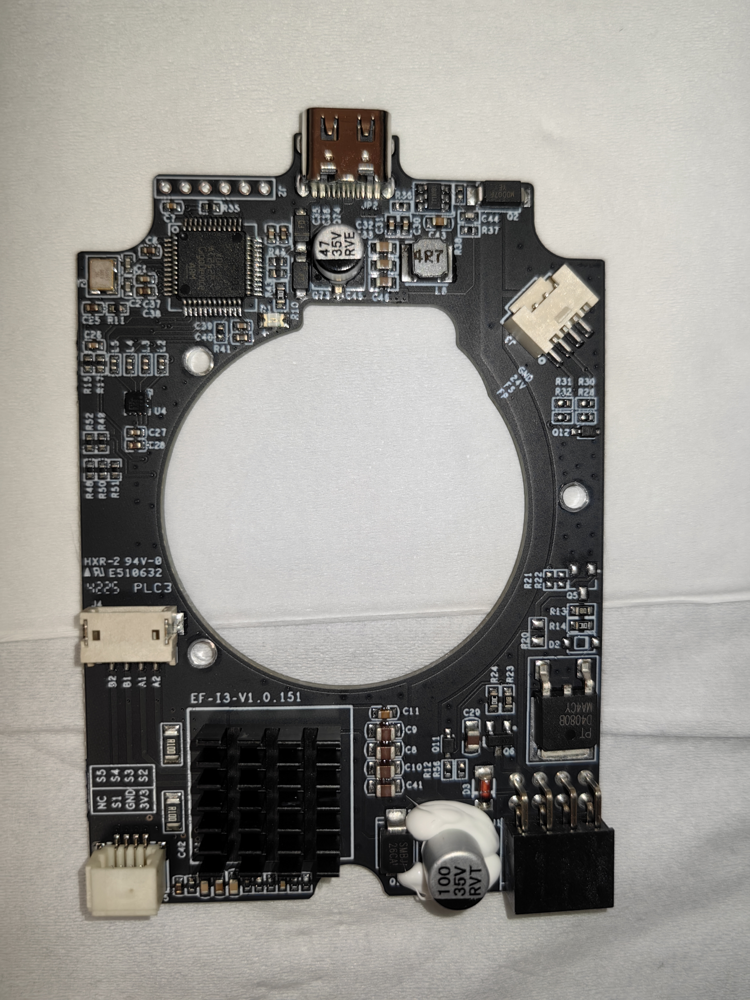
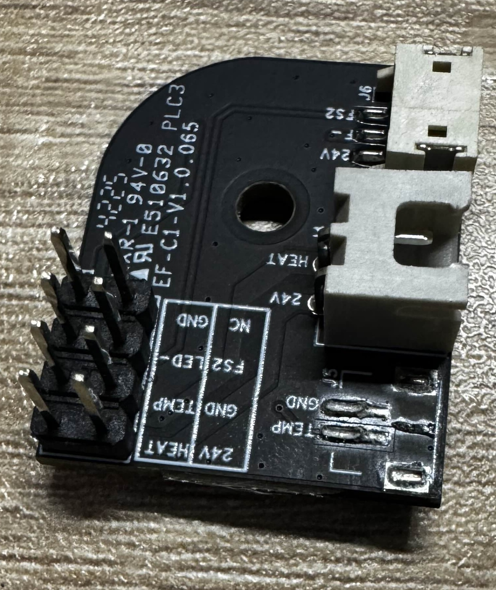
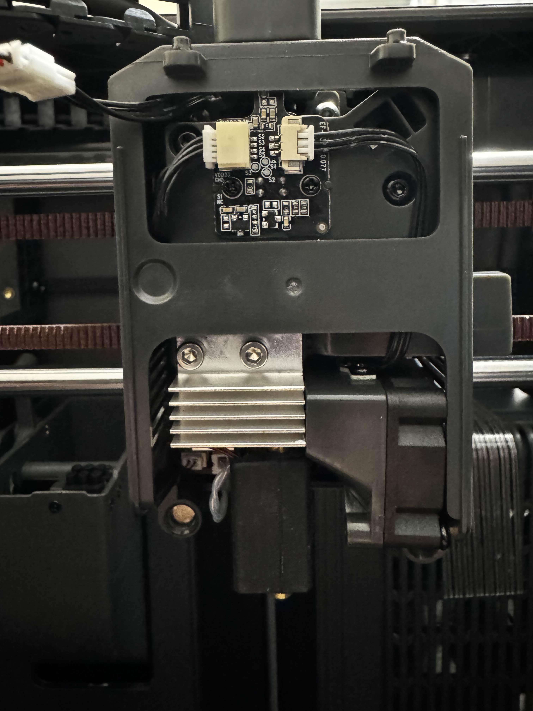
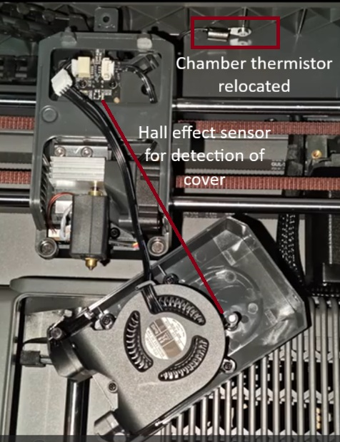
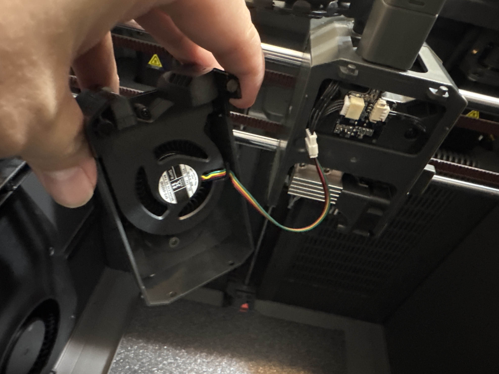

{ width="800" }
/// caption
Credit to keefe826 on the OpenCentauri Discord.
///

The toolhead board is connected over a USB-C cable. Unlike the CC1 serial is used instead of USB protocol for communication. The toolhead board is receives 24v power.

## Supplementary board

{ width="600" }
/// caption
Credit to keefe826 on the OpenCentauri Discord.
///

The Toolhead board has an 2x4 pin port at the bottom of the board. This connector connects to a separate pcb, that breaks out the necessary connectors for the hotend (Temperature sensor, heater, hotend fan).

## Filament detector Board

{ width="800" }
/// caption
Credit to keefe826 on the OpenCentauri Discord.
///

The CC2 has an additional filament detector board that connects to the bottom port on the opposite side of the supplementary board pins on the toolhead board. This board appears to use an optical sensor the detect the if filament has entered the extruder and is aligned with the filament path in the extruder shell. A new front and rear extruder shell are used to accommodate the filament detector and filament multiplexer. This board additionally hosts a hall effect sensor that is used for toolhead cover detection by means of a small magnet that has been added to the CC2 toolhead.

{ width="600" }
/// caption
Credit to keefe826 on the OpenCentauri Discord.
///

## Unknown hotend fan shroud board

A small board screwed into the hotend fan shroud can be seen. the function of this board is currently unknown.

## MCU

Metric|Value
---|---
MCU|
Vendor Id|
Product Id|
Device BCD|
Product|
Manufacturer|
Stepper driver|tmc2209

## Hardware

Metric|Value
---|---
Motor type|10T NEMA14 (round, 20.5mm long)
Motor P/N|BJY36D12-04V28
Motor MFG|SHENZHEN  KELI MOTOR  LTD
Extruder gear ratio|52:10
Extruder hobbed gear diameter|10mm nominal
Heater type|Ceramic plate-type PTC heater
Heater resistance|~9.6Ω
Heater power|60W
Part cooling fan type|5020 custom radial fan integrated into duct, 4 pin (tach+5V PWM)
Part cooling fan P/N|
Part cooling fan power|0.50A @ 24V
Hotend fan type|3010 axial fan, 3 pin (tach)
Hotend fan P/N|
Hotend fan power|0.10A @ 24V

{ width="800" }
/// caption
Credit to keefe826 on the OpenCentauri Discord.
///