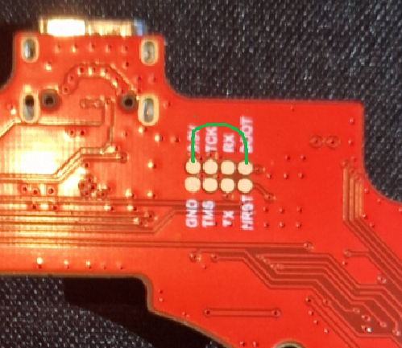

# Remove hotend board

1. Unscrew the 3 screws at the back of the hotend that keeps the plastic case in place.
1. Unscrew the 1 screw at the bottom of the hotend keeping the horizontal board in place.
1. Pull the horizontal board down **gently**, disconnecting from the main hotend board.
1. Unscrew the 3 small screw holding the hotend board.
1. Disconnect the fan and motor.
1. Unscrew and disconnect the USB-C cable on the top of the hotend.
1. Pull the hotend board out.

# Flashing

1. On the underside of the board there are 8 small copper pads. You have to short the "BOOT" to "3.3v"

1. Connect the board to your PC with an USB-C cable **WHILE** keeping *BOOT* shorted to *3.3v*. You can release it after the USB cable is plugged in.
1. Open STM32Cube Programmer
    1. Select USB mode. If you connected the board correctly, it should show up in the "Port" list
when you refresh it.
    1. Tick the "Read Unprotect" checkmark. **Connecting will cause your original hotend firmware to be wiped** There is no return after this step.
    1. Click connect.