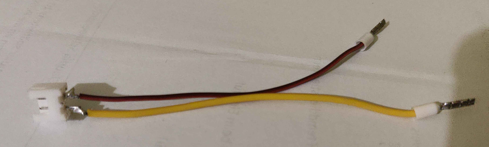
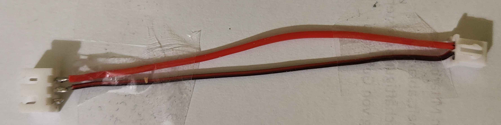
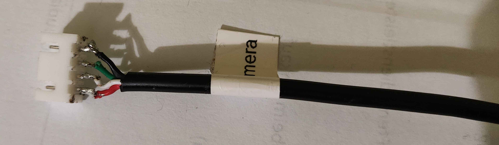

# Replace mainboard

## Picking a mainboard

You will need any 3D printer mainboard that:

- accepts 24V power
- has three fan outputs (ideally 3 pins, for mainboard cooling, side and chamber)
- has three stepper drivers (ideally TMC2209 or similar, for X, Y and Z)
- has support for sensorless homing with those two of those drivers (X and Y axes)
- has support for two thermistors (bed and chamber)
- has support for one heater output (bed)
- has support for at least two endstops (optical Z endstop and filament sensor)

You will also need a Linux computer to run the Klipper host on, which can be a Raspberry Pi or similar.

!!! warning

    The Raspberry Pi Zero W and Zero 2 W are not recommended due to their limited performance and occasional USB dropouts when restarting Klipper.

From our testing, the following boards are known to work:

<!-- TODO: Discuss if we want affiliate links -->

- [BigTreeTech SKR Mini E3 V3.0](https://biqu.equipment/products/bigtreetech-skr-mini-e3-v2-0-32-bit-control-board-for-ender-3)
- [BigTreeTech Octopus v1.1](https://biqu.equipment/products/bigtreetech-octopus-v1-1)
    - On the BTT Octopus, you will have to snip off the JST-XA retention lever because the sockets are too close together

## Making adapter cables

You will need to make four custom cables to connect various components to the new mainboard:

### Toolhead cable

The toolhead uses a USB-C cable but it expects 24V power on the VBUS pin, so you will need to make a custom cable that connects the VBUS and GND pins to a 24V power source.

I recommend getting a USB-C breakout board with four or six pins and soldering the cables to it.

!!! note

    TODO(devminer): Add picture

### Bed heater cable

The bed heater cable is a 2-pin JST-XA connector, but most mainboards use a 2-pin terminal block or 2 pin screw terminal instead.

There is not much power going through this cable, so we recommend finding a 2-pin JST-XA or JST-XH socket and soldering two cables to it.

Depending on if your mainboard uses a screw terminal, then crimp the other ends with ferrules.
If it uses a terminal block instead, then you should crimp the other ends with spade/fork connectors.

!!! note

    Make sure you connect the bed heater cable in the correct polarity. If you connect it backwards, the bed won't heat up.

### Mainboard fan cable

The mainboard fan cable is a 3-pin JST-XA connector, but most mainboards use a 2-pin JST-XH instead. We need to omit the 3rd pin since it's the tachometer pin that operates at a voltage not suitable for directly injecting into the MCU of the mainboard. It [needs some extra wiring](https://www.nicksherlock.com/2022/01/driving-a-4-pin-computer-pwm-fan-on-the-btt-octopus-using-klipper/).

### Camera cable

The camera is a normal USB camera, but it's connected via a JST-XA connector, so you will need to wire an adapter cable from JST-XA/XH to USB-A. 

You can cut off the other side of an old USB cable and solder it to a JST-XA/XH connector, or you can buy a USB-A male kit from Aliexpress to make your own.

!!! note

    Remember to not flip the colors in USB cables. The red wire is +5V, black is GND, white is D- and green is D+.

