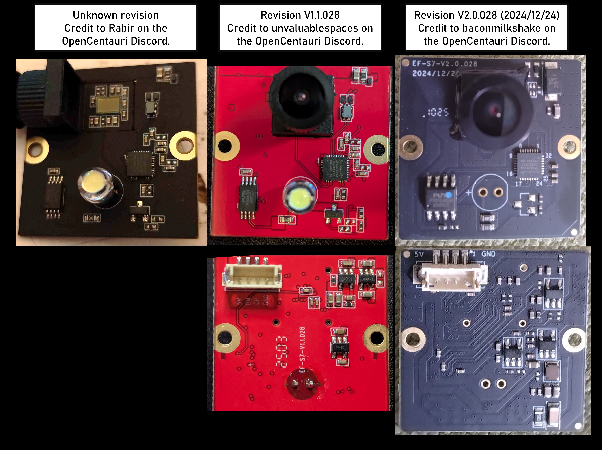
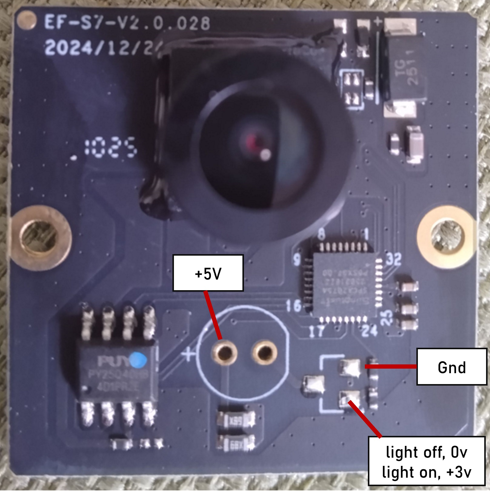
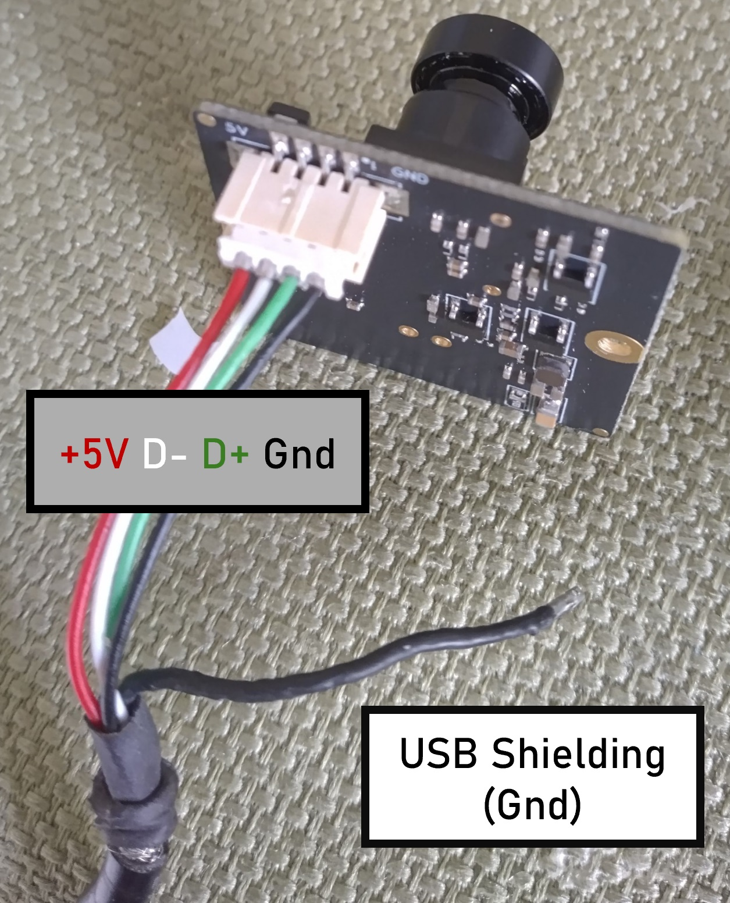
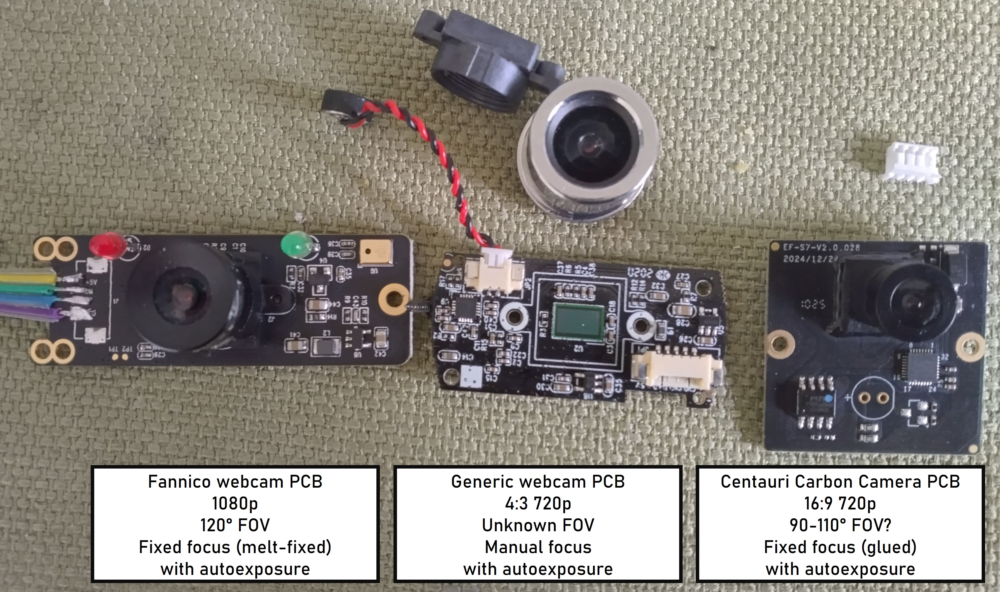
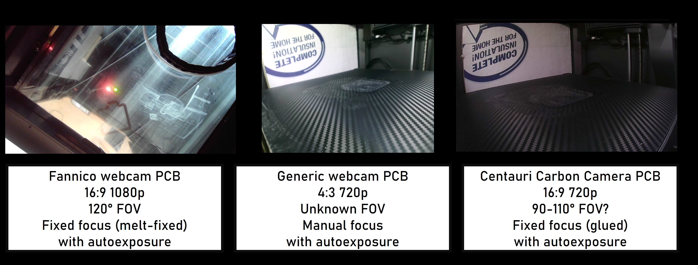

Metric|Value
---|---
Resolution|720p(1280x720)
Aspect Ratio|16:9
Max Refresh Rate|30 Hz
Focus|Fixed (glued barrel adjustment)
FOV|90-110°?
Exposure|Auto
PCB Dimensions|30mmx30mm
Connector|4 pin JST-ZH (1.5mm pitch)
Communication Protocol|USB 2.0
Display Name|"Integrated Camera"
Listed Power|500 mA @5V
USB Transceiver|SunplusIT SPCA2075A
Flash|PUYA P25D40SH or PY25Q128HB

## Camera Revisions
At least three revisions of the Centauri Carbon camera PCB exist. The most recent
version (V2.0.028) is included in units that shipped with 24 LED strip lighting
and lack the LED on the camera and associated YP3 surface mount transistor. However
the pin for LED control is still active. Testing shows when the chamber lights are
turned on the pad for the transistor gate changes from 0 to +3V.

{ width="800" }
/// caption
Credit to Rabir, unvaluablespaces, and baconmilkshake on the OpenCentauri Discord.
///

{ width="350" }
/// caption
Camera LED control on a V2.0.028 board lacking an LED and switching transistor
 showing switching transistor pads are still functional.
Credit to baconmilkshake on the OpenCentauri Discord.
///

## Camera Pins

Pin|Value
---|---
1/GND| GND
2/DP| D+
3/DN| D-
4/5V| +5v

{ width="350" }
/// caption
Camera shown attached to a USB cable for a PC webcam with standard color coded
USB wires. The second ground connector is for USB cable shielding and is not neccessary.
Credit to baconmilkshake on the OpenCentauri Discord.
///

## Camera Replacement/Compatability

!!! note

    The mounting location for the stock camera can accommodate up to 42mmx42mm.
    Use of a wider replacement camera module is possible if the module is shifted
    toward the rear of the printer, but the maximum height is fixed.

!!! warning

    Make sure your replacement camera has a wide FOV (>90°) to see the whole build plate

Replacement of the stock camera with other USB cameras has been tested with at least
 two webcam PCBs, and the Centauri Carbon webUI works with multiple different camera
 resolutions and aspect ratios, including 1080p- higher than the resolution of the
 stock camera. Replacement can be accomplished through simply switching the PCB if
 the same connector is used, although JST-ZH connectors are very uncommon on consumer
 cameras excluding Arducam cameras and adapter boards. Alternatively the original webcam's
 cable may cut and solder onto the CC camera cable.
 

{ width="600" }
/// caption
Alternate webcam PCBs used during testing
///

 Camera performance in terms of resolution, image clarity, and brightness in use may vary.

{ width="800" }
/// caption
Screenshots from the Centauri Carbon webUI with alternate cameras attached.
Due to temporary wiring the 1080p Fanniko PCB was only aimed directly upward from the bed during testing to verify functionality at higher than stock resolution.
Credit to baconmilkshake on the OpenCentauri Discord.
///

