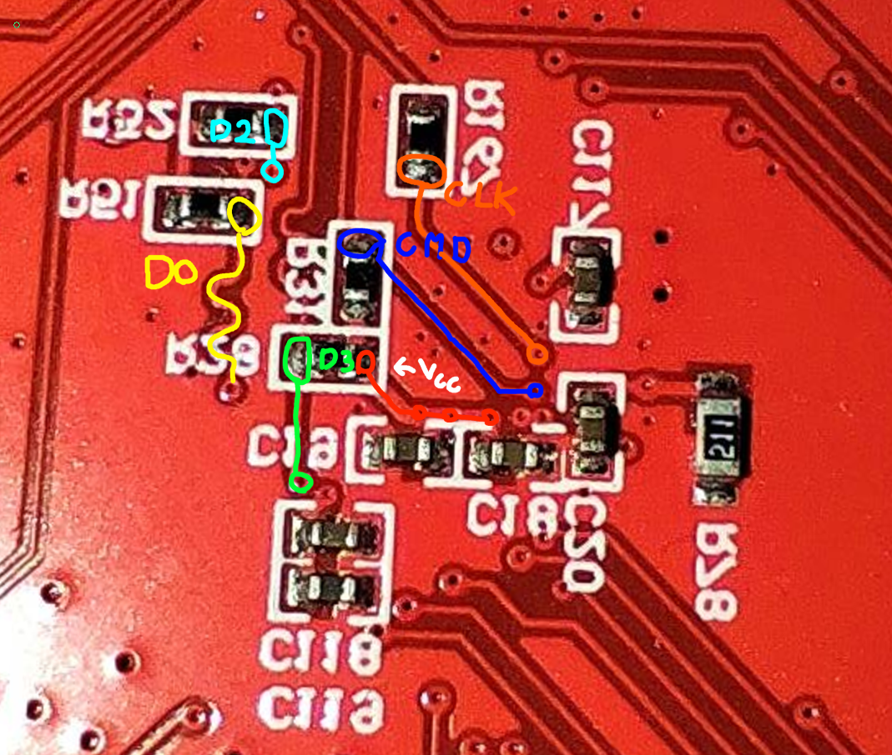

The CC uses it's EMMC module in 4-line mode. VCCQ and VCC are shorted together to 3.3v.
During tapping the MCU must be powered down and/or held reset with the onboard button.

|EMMC Pin|Tap Point|PCB Side|Remarks|
|-------|--------|----|----|
|VCC/VCCQ|Any 3v3 line, or R28 opposite pad from D3 tap point|
|GND|The board's GND|
|CMD|R32|Bottom|The pad next to the "R"|
|CLK|R167|Bottom|The pad next to the "7"|
|D0|R51|BOTTOM|The pad opposite from the text|
|D1|R53|Top|the pad closer to the crystal|
|D2|R52|Bottom|The pad opposite from the text|
|D3|R28|Bottom|The pad toward the text|

## Top side traces & tap points

## Bottom side traces & tap points
