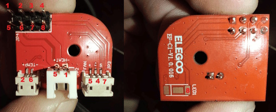

Metric|Value
---|---
MCU|STM32F402RCT6
USB Spec|v1.0 (full-speed)
Vendor Id|1d50
Product Id|614e
Device BCD|2.00
Product|STM32 Virtual ComPort
Manufacturer|ShenZhenCBD
Stepper driver|tmc2209

Front|Back
---|---
{ width="800" }|{ width="800" }
Credit to thijskunst on the OpenCentauri Discord.|Credit to thijskunst on the OpenCentauri Discord.

The hotend is connected over a USB-C cable. This USB-C interface carries 24v. Communication is done via a serial-over-usb interface. The MCU provides a virtual com port when booted. The hotend runs Klipper MCU firmware, specifically [v0.9.1-616-g28f60f7e-dirty-20220408_035823-fluiddpi](https://github.com/Klipper3d/klipper/commit/28f60f7ef69847f1514371d1c6788c3c0df98533)

!!! danger
    Note: flashing back this same klipper commit to the MCU makes the Centarui Carbon no longer boot. The boot process continues as soon as the MCU is unpluged. This is still being investigated.

!!! example
    The board boots from a simple 5v USB connection.

!!! warning
    You can make the hotend board boot into DFU mode by bridging the boot and 3.3v pins on the back during power-on. The board is in Read Out Protection mode.

## Supplementary board

{ width="600" }
/// caption
Credit to rabirx on the OpenCentauri Discord.
///

The hotend board has an 2x4 pin port at the bottom of the board. This connector connects to a seperate pcb, that breaks out the nessesary connectors for the hotend (Temperature sensor, heater, hotend fan).