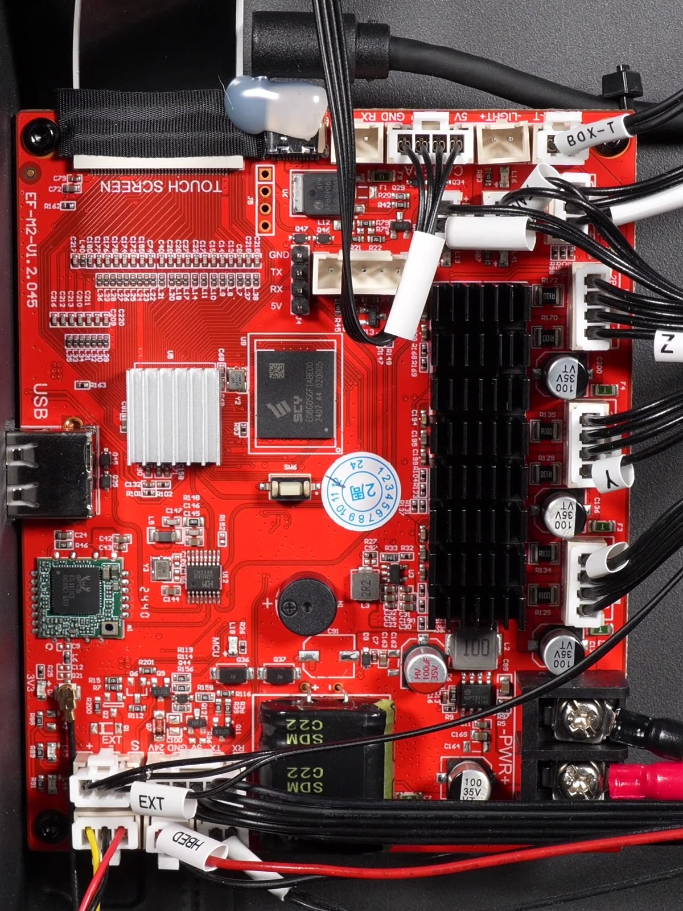

Metric|Value
---|---
SoC|AllWinner R528-S3
Memory|128 MB in-chip
Storage|8gb eMMC
Stepper drivers|tmc2209

Front|Back
---|---
{ width="800" }|{ width="800" }
Credit to the Elegoo discord.|Credit to thijskunst on the OpenCentauri Discord.

## Mainboard Pins

### 24V input
Type: 2-Pin Barrier terminal with 9.6mm pin pitch
|pin nr|marking|Function|remarks|
|--|---|----|---|
|1| - | GND |Closest to the stepper connectors|
|1| + | +24V |Do nnot overtighten as it is very flimsy|

### Steppers X,Y and Z
Type: JST-**XA**-4P 
|pin nr|marking|Function|remarks|
|--|---|----|---|
|1| 2B|2B||
|3| 1A|1A||
|2| 2A|2A||
|4| 1B|1B||

### filament sensor
Type: JST-**XA**-3P
|pin nr|marking|Function|remarks|
|--|---|----|---|
|1| S | Signal | **3.3v** when filament is detected|
|2| - | GND ||
|3| + | +5V ||

### Chamber temp sensor (marked "BOX-T" on the board)
Type: JST-**XA**-2P
|pin nr|marking|Function|remarks|
|--|---|----|---|
|1| none | Sig |standard NTC100k B3950| 
|2| none | GND ||

### Light
Type: JST-**XA**-2P
|pin nr|marking|Function|remarks|
|--|---|----|---|
|1| + | +24V | Max 1A | 
|2| - | GND_PWM| |

### Side fan (Marked "FAN-1" on the board)
Type: JST-**XA**-2P
|pin nr|marking|Function|remarks|
|--|---|----|---|
|1| + | +24V | MAX 1A|
|2| - | GND_PWM ||

### Rear exhaust Fan (marked "BOX-F" on the board)
Type: JST-**XA**-2P
|pin nr|marking|Function|remarks|
|--|---|----|---|
|1| + | +24V | MAX 1A|
|2| - | GND_PWM ||

### Camera
Type: JST-**XA**-4P
|pin nr|marking|Function|remarks|
|--|---|----|---|
|1| GND | GND | regular usb port but with a JST connector|
|2| DP | USB-DP ||
|3| DM | USB-DM ||
|4| 5v | +5V ||

### UART0
Type: JST-**XA**-2P + 4-Pin 2.54mm pin header
|pin nr|marking|Function|remarks|
|--|---|----|---|
JST:
|1| TX | RS232-TX | connected to 4-pin header|    
|2| RX | RS232-RX | 

4-Pin Header:
|pin nr|marking|Function|remarks|
|--|---|----|---|
|1| GND | GND | square pad |
|2| TX | RS232-TX |
|3| RX | RS232-RX |
|4| 5v | +5V | J4 marking|

### Multicolor
Type: JST-**XA**-5P
|pin nr|marking|Function|remarks|
|--|---|----|---|
|1| 24V  | +24V | 24v for motors inside the MMU|
|2| GND | GND ||
|3| 5V | +5V | 5v can be turned off to reset MCU in the MMU |
|4| DM | USB-DM | standard usb 2.0 |
|5| DP | USB-DP | |
 
### USB-C --> Extruder Board
Type: USB-C (USB 2.0 only)

    WARNING!! Do not plug in anything other than the extruder board. this type-C connector has 24v vcc instead of 5v. Anything you plug in WILL GET FRIED!!

|pin nr|marking|Function|remarks|
|--|---|----|---|
|A1 |no markings | GND  | |
|A2 | | | |
|A3 | | | |
|A4 | | **24V!** VCC | Switched 24V |
|A5 | | | |
|A6 | |USB 2.0 DP | |
|A7 | |USB 2.0 DM | |
|A8 | | | |
|A9 | | **24V!** VCC | Switched 24V |
|A10| | | |
|A11| | | |
|A12| | GND | |

### Display
Type: xx Pin FFC

RGB888 display + touch\
``unknown pinout``

### Front  USB
Type: USB-A

|pin nr|marking|Function|remarks|
|--|---|----|---|
|1| GND | GND | regular usb-A port|
|2| DP | DP ||
|3| DM | DM ||
|4| 5v | +5V ||

### Z-endstop (Marked "EXT" on the board)
Type: JST-**XA**-3P
|pin nr|marking|Function|remarks|
|--|---|----|---|
|1| | +24V||
|2| | GND||
|3| | SIG |3.3V pullup, LOW/0v when bed is not in sensor|

### Mainboard fan "BFAN"
Type: JST-**XA**-3P
|pin nr|marking|Function|remarks|
|--|---|----|---|
|1|  | +24V ||
|2|  | GND_PWM | Controlled by MCU
|3|  | Tacho ||

### Bed MCU (RS-232)
Type: JST-**XA**-5P
|pin nr|marking|Function|remarks|
|--|---|----|---|
|1| 24V | +24V | Not used on the leveling mcu board|
|2| GND | GND |
|3| 5V | +5V | 5v is switched to reset the bed MCU |
|4| TX | TX||
|5| RX | RX||

### Bed heater "HBED"
Type: JST-**XA**-2P
|pin nr|marking|Function|remarks|
|--|---|----|---|
|1| - | GND_PWM | Controlled by MCU|
|2| + | +24V||

### Bed temperature sensoor "BED-T"
Type: JST-**XA**-2P
|pin nr|marking|Function|remarks|
|--|---|----|---|
1|  | SIG|  NTC100k B3950|
2|  | GND|  |
