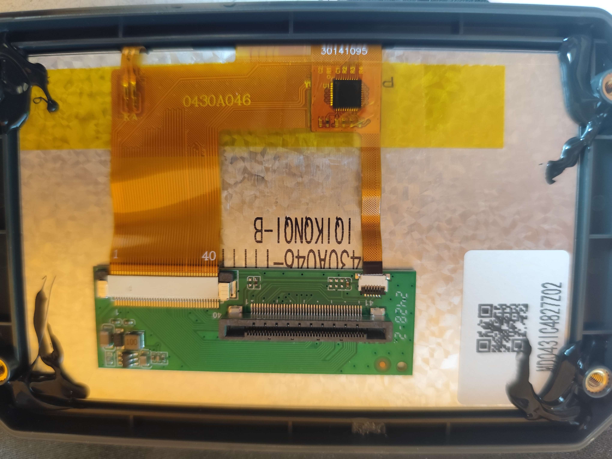

{ width="600" }
/// caption
Credit to rabirx on the OpenCentauri Discord.
///

The screen is a generic `0430A046-I1I1100` LCD screen (capacitive touch screen version). The display is driven directly by the Alwinner SOC.