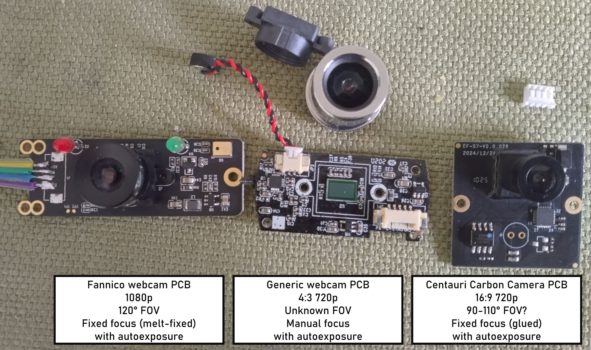
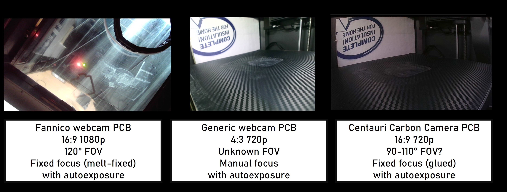

# Camera Replacement

!!! note

    The mounting location for the stock camera can accommodate up to 42mmx42mm.
    Use of a wider replacement camera module is possible if the module is shifted
    toward the rear of the printer, but the maximum height is fixed.

!!! warning

    Make sure your replacement camera has a wide FOV (>90°) to see the whole build plate.

Replacement of the stock camera with other USB cameras has been tested with at least
two webcam PCBs, and the Centauri Carbon webUI works with multiple different camera
resolutions and aspect ratios, including 1080p — higher than the resolution of the
stock camera. Replacement can be accomplished through simply switching the PCB if
the same connector is used, although JST-ZH connectors are very uncommon on consumer
cameras excluding Arducam cameras and adapter boards. Alternatively the original webcam's
cable may be cut and soldered onto the CC camera cable.

See the [CC1 Camera](../hardware/CC1/camera.md) page for the stock camera pinout.

{ width="600" }
/// caption
Alternate webcam PCBs used during testing.
///

Camera performance in terms of resolution, image clarity, and brightness in use may vary.

{ width="800" }
/// caption
Screenshots from the Centauri Carbon webUI with alternate cameras attached.
Due to temporary wiring the 1080p Fanniko PCB was only aimed directly upward from the bed during testing to verify functionality at higher than stock resolution.
Credit to baconmilkshake on the OpenCentauri Discord.
///
