# Printable Mods

Community-designed printable modifications for the Centauri Carbon series, organized by area of the printer. Unless otherwise noted, parts should be printed in ASA or ABS.

---

??? abstract "Strain Relief & Peripherals"

    ### Cable Arm Riser and Vertical Strain Relief

    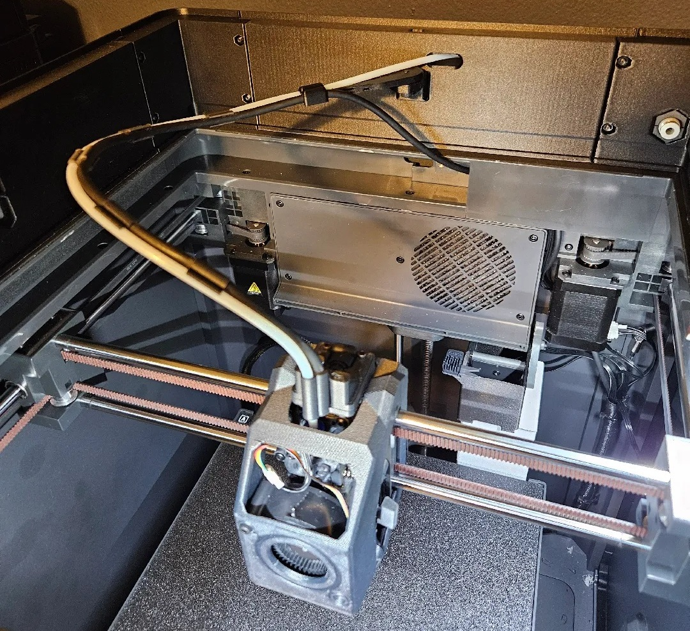{ width="400" }

    Solutions for the failure-prone USB cable routing on the CC1. Encouraged for all CC1 users though not compatible with CANVAS or new V2 toolhead cable with 135 degree angle.

    ??? info "Details"

        Daniel Cherubini's [vertical strain relief](https://www.printables.com/model/1447575-elegoo-centarui-carbon-usb-cable-strain-guide) and Devin's cable arm risers ([1](https://www.printables.com/model/1450583-centauri-carbon-cable-arm-sturdy-riser), [2](https://www.printables.com/model/1412274-elegoo-centauri-carbon-low-riser-remix-fixed), [3](https://www.printables.com/model/1452465-centauri-carbon-cable-arm-vented-riser)) are the currently recommended solutions for protecting the CC1 USB cable connection against mechanical fatigue and damage.

??? abstract "Hotend"

    | | Stock | H2D/A1 Retrofit | Constellation | Microswiss Flowtech |
    |---|---|---|---|---|
    | **Compatibility** | All | All | CC1 | All, different SKU |
    | **Flow** | ~ | ~ | - CS, ~ SF, ++ HF | + CHT, - non-CHT |
    | **Nozzle swap** | Full hotend | Hotend clip | Hot SF/HF, Cold CS, | Cold |
    | **Heatbreak** | Structural | Nonstructural | Nonstructural | Nonstructural |
    | **Cost** | n/a | Low–moderate | Low | High (commercial) |
    | **Nozzle type** | | Bambu H2D/A1 | V6 / Bambu X1/P1 | Flowtech / CHT |
    | **Assembly** | n/a | Moderate | High | Drop-in |
    | **Requirement** | n/a | High-temp filament, annealing | Most parts self-sourced | — |

    ---

    ### H2D/A1 Hotend Retrofit

    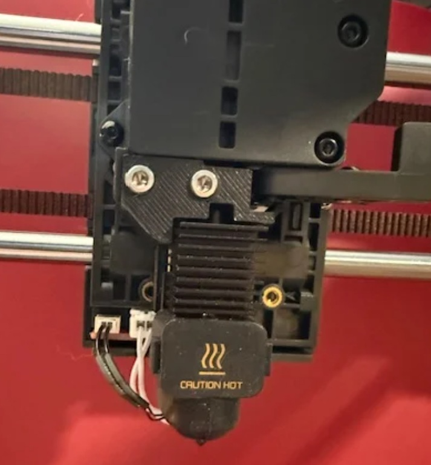{ width="250" }

    Printable models and premade kits (e.g., ECCH2A1) adapting Bambu H2D/A1 nozzles to the Centauri Carbon. Compatible with CC1, CC2, and CANVAS.

    ??? info "Details"

        Allows use of H2D/A1 nozzles, enabling rapid nozzle changes. The ECCH2A1 is a popular premade solution available on Etsy.

        - **Pros:** Premade solutions available, rapid nozzle changes, non-structural heatbreak, low-to-moderate cost when self-sourced, compatible with CC1, CC2, and CANVAS.
        - **Cons:** Requires high-temperature print materials (PPS, PPA, PA6/12, or filled PET) or annealing. Hotends are not cross-compatible between CC1 and CC2.

    ---

    ### Constellation Extruder

    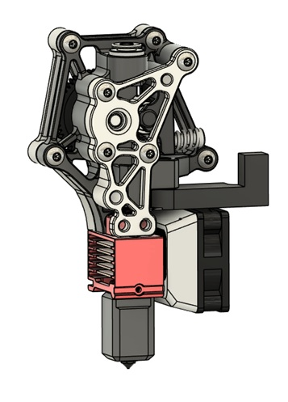{ width="250" }

    A full extruder housing replacement by that reuses the stock extruder internals and mounts Bambu X1/P1-compatible hotends. Currently CC1 only.

    [:octicons-arrow-right-24: Download on Printables](https://www.printables.com/model/1382168-constellation-extruder-for-elegoo-centauri-carbon)

    ??? info "Details"

        Three versions are available for different configurations. Supports the TZ clone ecosystem and the Pika hotend, among others.

        - **Pros:** Non-structural heatbreak, low cost, standard V6 nozzle compatibility, no annealing required, high-flow or cold-pull options available.
        - **Cons:** Most parts must be self-sourced, higher assembly complexity, not yet compatible with CC2 or CANVAS.

    ---

    ### Microswiss Flowtech

    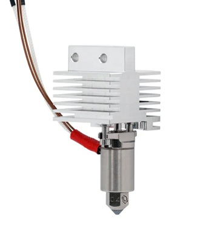{ width="200" }

    A commercial drop-in hotend using Flowtech nozzles with a non-structural heatbreak. Nozzle ecosystem is shared with the Bambu Lab X1/P1 Flowtech. Available for CC1 and CC2.

    [:octicons-arrow-right-24: Purchase from Micro-Swiss](https://store.micro-swiss.com/products/flowtech-hotend-for-elegoo-centauri-carbon)

    ??? info "Details"

        Uses a heatblock similar to the Bambu Lab X1/P1 and supports CHT nozzles, though with a shorter melt zone than the stock CC hotend.

        - **Pros:** Drop-in fit, shared nozzle ecosystem, easy nozzle swaps, non-structural heatbreak, available for CC1 and CC2.
        - **Cons:** High cost, may not be rated to 320°C.

??? abstract "Toolhead"

    | | Stock | Γ/Gamma | ACCTC | SE3D | Proxima |
    |---|---|---|---|---|---|
    | **Approx. mass** | ~120g | ~95g | ~70g | ~100g | ~60g |
    | **Mounting** | Magnetic (weak) | Magnetic (strong) | Screws | Dovetail + screws (mods available) | Screws |
    | **Compatibility** | ~ | CC1 | CC1 | CC1 | All |
    | **Strength** | High | High | High | Low-Medium | High |
    | **Key feature** | ~ | Tool-free snap fit | Optimized intake; rigid mount | Most variants/remixes | CFD duct; 5015 fan |

    ---

    ### Γ/Gamma

    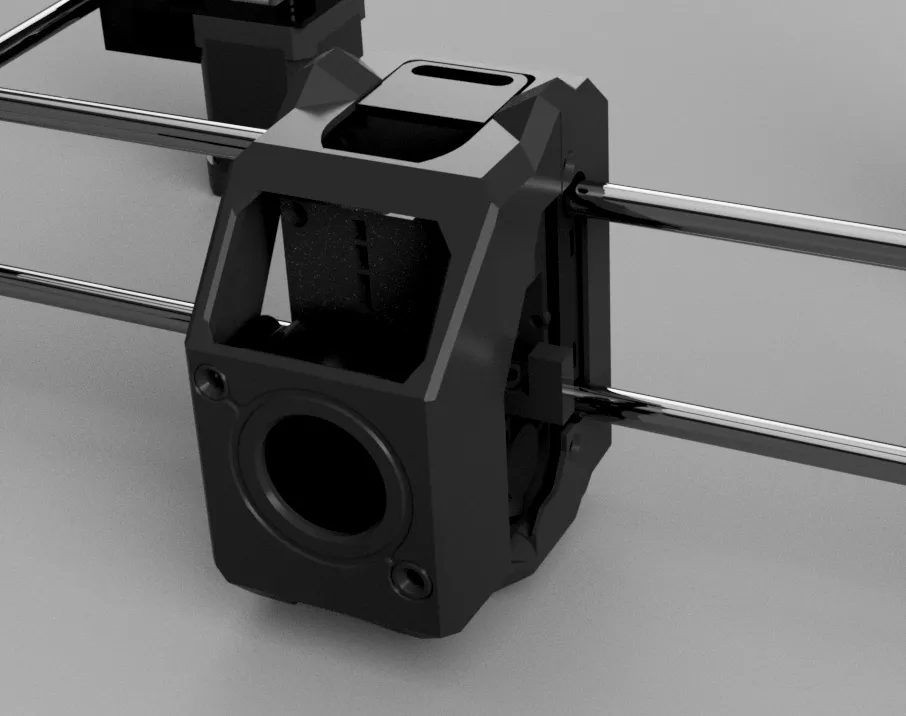{ width="400" }

    A moderately mass-reduced, high-strength toolhead shell with tapered magnetic pin mounting for a secure, tool-free fit.

    [:octicons-arrow-right-24: Download on Printables](https://www.printables.com/model/1410999-g-gamma-toolhead-cover-for-elegoo-centauri-carbon)

    ??? info "Details"

        Magnets are seated in tapered pins, providing a secure snap-fit that holds firmly without tools. A well-established design with widespread adoption in the community.

    ---

    ### ACCTC

    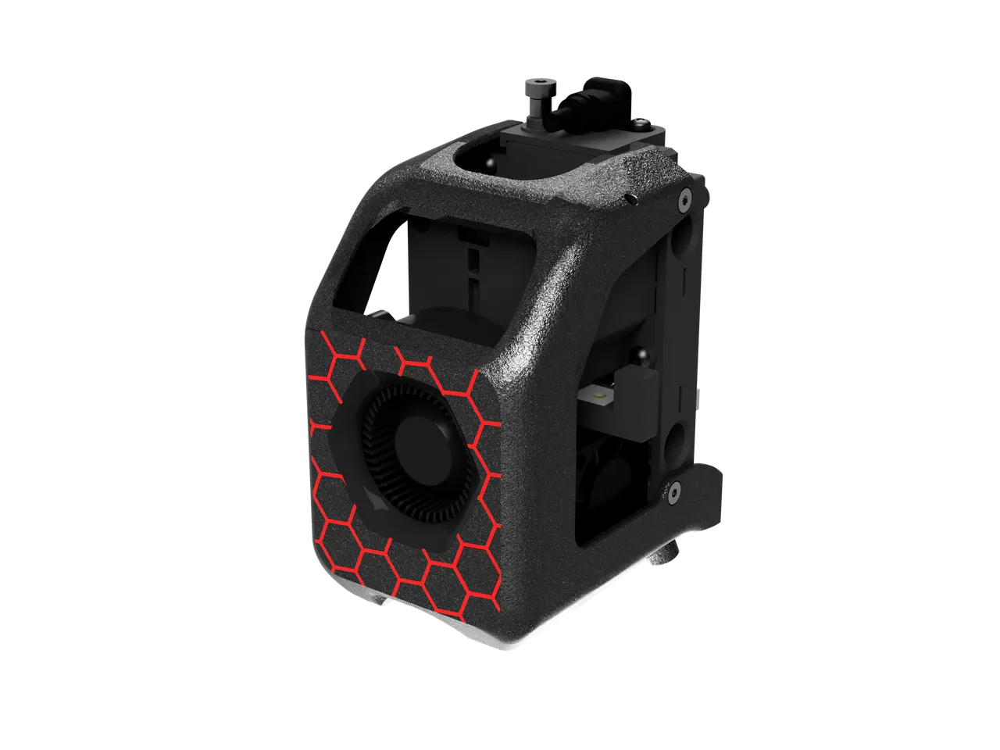{ width="400" }

    A highly mass-reduced toolhead shell loosely derived from Gamma, using rigid screw mounting.

    [:octicons-arrow-right-24: Download on Printables](https://www.printables.com/model/1575497-another-centauri-carbon-toolhead-cover)

    ??? info "Details"

        Another Centauri Carbon Toolhead Cover (ACCTC) prioritizes mass reduction while using screws for a rigid, rattle-free mounting.

    ---

    ### SE3D

    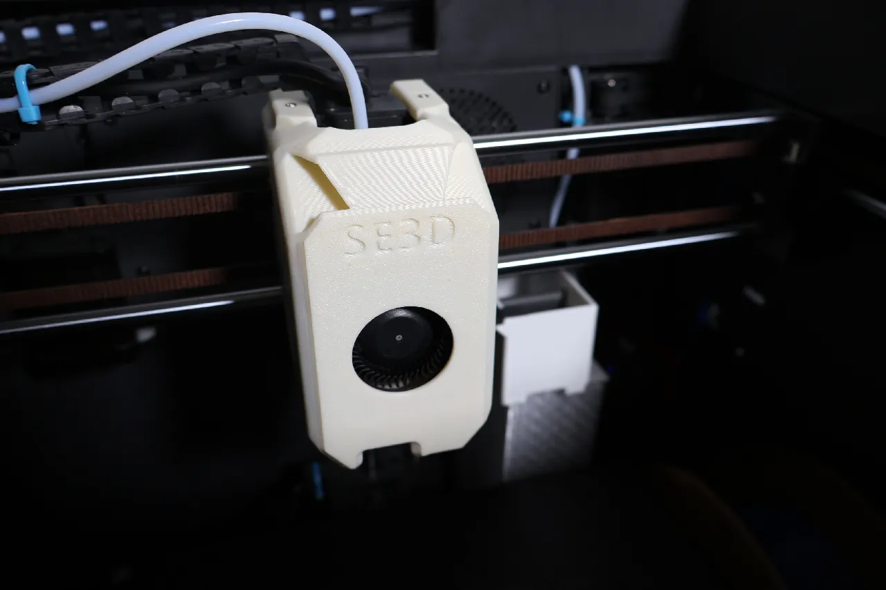{ width="400" }

    The original community toolhead cover for the Centauri Carbon, featuring dovetail-peg-and-screw mounting with numerous available variants.

    [:octicons-arrow-right-24: Download on Printables](https://www.printables.com/model/1399340-se3d-elegoo-centauri-carbon-toolhead-cover)

    ??? info "Details"

        Moderately mass-reduced with a dovetail peg and screw mounting system. Many community variants exist offering alternate mounting styles, further mass reduction, and aesthetic changes.

    ---

    ### Proxima Toolhead Cover

    | | |
    |:---:|:---:|
    | 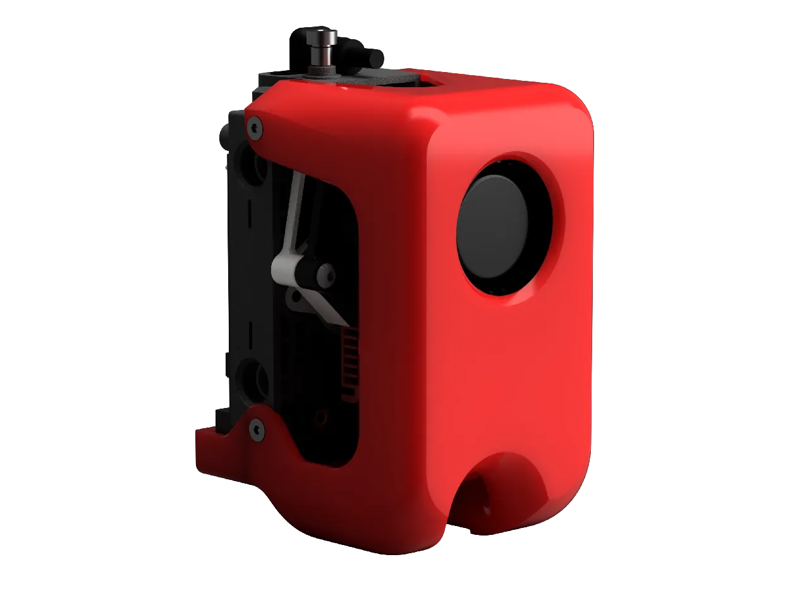{ width="360" } | 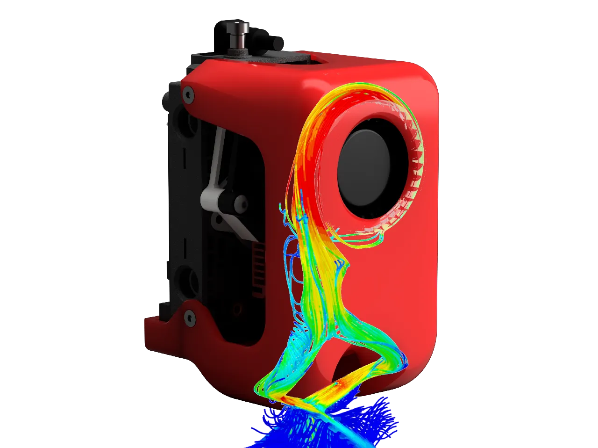{ width="360" } |

    The lightest available toolhead cover by [clogged\_nozz](https://www.printables.com/@clogged_nozz_2035917), at approximately 60g total. Features a CFD-optimized part cooling duct and supports CC1, CC1 CANVAS, and CC2. Uses a Bambu Lab-style wide-mouth 5015 4-pin fan — an inexpensive, widely available part that replaces the stock 5020 4-pin fan, which is not available as a standalone replacement on the CC1 and CC2.

    [:octicons-arrow-right-24: Download on Printables](https://www.printables.com/model/1694872-proxima-toolhead-cover-for-elegoo-centauri-carbon)

    ??? info "Details, BOM & Installation"

        ~33g printed (ASA) + ~25g fan + ~2g hardware = **~60g total**, vs. 95g (Gamma), 99g (SE3D), and 120g+ (stock).

        **Key features:**

        - Lightest cover available with a favorable center of mass
        - Common, inexpensive 5015 part cooling fan (Bambu Lab X1 style)
        - Simulation-aided duct geometry with multiple CFD iterations and physical testing
        - Access port for filament tension adjustment and extruder gear inspection
        - Improved hotend fan airflow
        - Optional LED diffuser
        - Modular front cowlings for personalization
        - Improved overall stiffness

        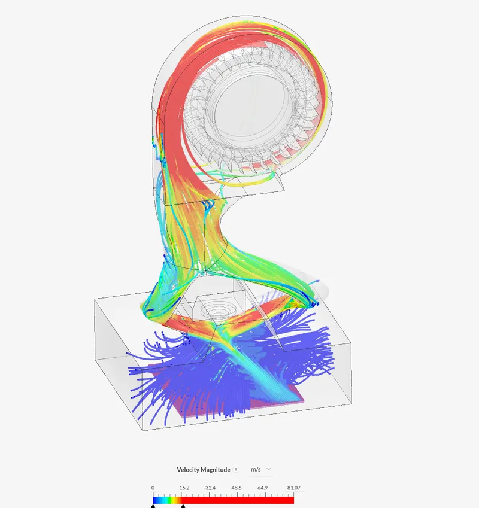{ width="500" }

        #### Bill of Materials

        | Qty | Item |
        |-----|------|
        | 2 | M3×14 BHCS |
        | 1 | M3×10 FHCS (or the back screw from the stock cowling) |
        | 4 | M3×6 FHCS (countersunk screws from the stock cowling) |
        | 1 | 5015 4-pin widemouth fan (Bambu Lab X1 style) |
        | 1 | Small magnet (any size) |

        #### Print Settings

        | Setting | Value |
        |---------|-------|
        | Layer height | 0.12 mm |
        | Walls | 2 |
        | Infill | 10% gyroid (or other low-density pattern) |
        | Supports | None |
        | Orientation | Print as oriented |
        | Material | ASA/ABS or better |
        | Slicer | Orca Slicer or derivative (required for modifiers) |

        #### Using the Front Cowling Modifiers

        1. Import `front cowling.3mf` and switch to **Object view** in your slicer.
        2. Select your desired duct type (default: round duct) and delete the others.
        3. Set the chosen duct as a **negative part** if it isn't already.

        !!! note "Cartographer"
            A Cartographer probe version is available for the standard v4 configuration on CC1 standalone only. Requires a full board swap.

        #### Installation

        1. Transfer the stock fan connector to the 5015 fan by carefully removing and reinserting the pins.
        2. Mount the fan to the cover using the two M3×14 BHCS.
        3. Install the back bumper screw.
        4. **CC1 CANVAS and CC2 only:** Place the small magnet on the left screw of the filament detection board to spoof the cowling detection sensor.

        !!! warning
            Check the minimum duty cycle at which your 5015 fan starts spinning — it may differ from the stock fan and could cause stall issues at low commanded speeds.

        #### Credits

        Atomique13 (CFD assistance) · Robert Samples (5015 fan model and cooling comparison) · Cofinhofin (planet logo) · Harrym (stock comparison testing) · ErWin (cowling detection spoofing method) · Hannibal · Aziraphaele · Laser Velociraptor · Chirimorin · Anna (CC2 and Canvas measurements and testing)

??? abstract "Gantry"

    ### Toothed Idler Blocks

    | | | |
    |:---:|:---:|:---:|
    | 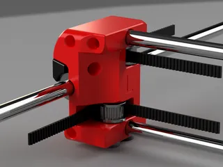{ width="225" } | 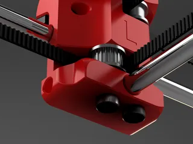{ width="225" } | 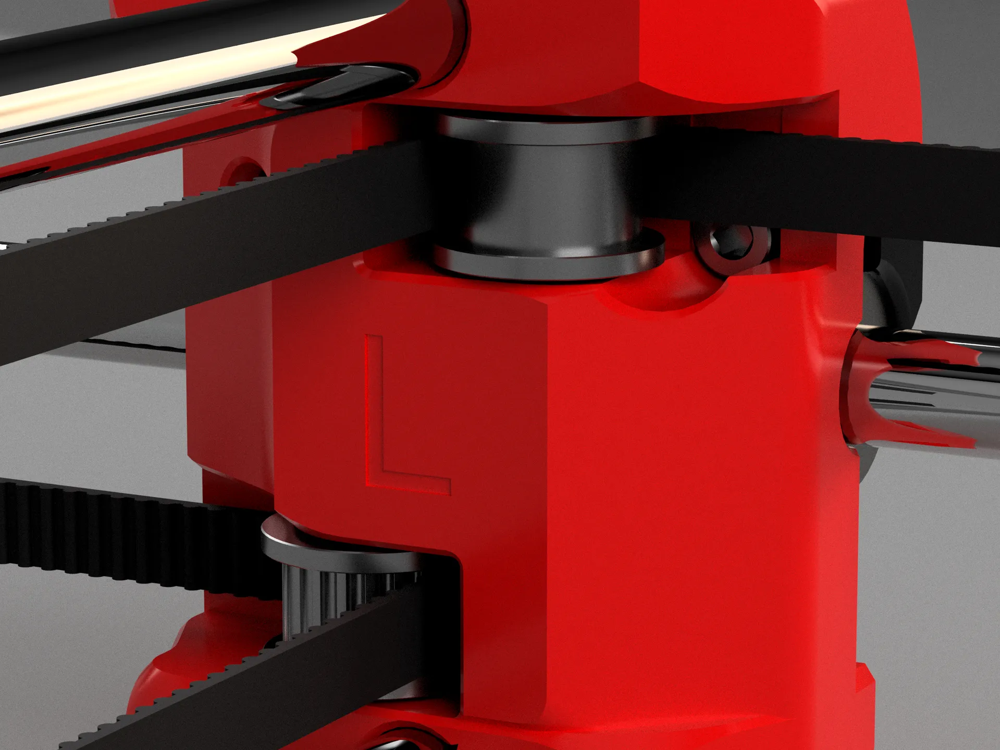{ width="225" } |
    | 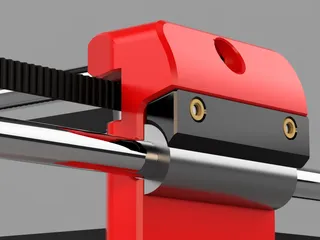{ width="225" } | 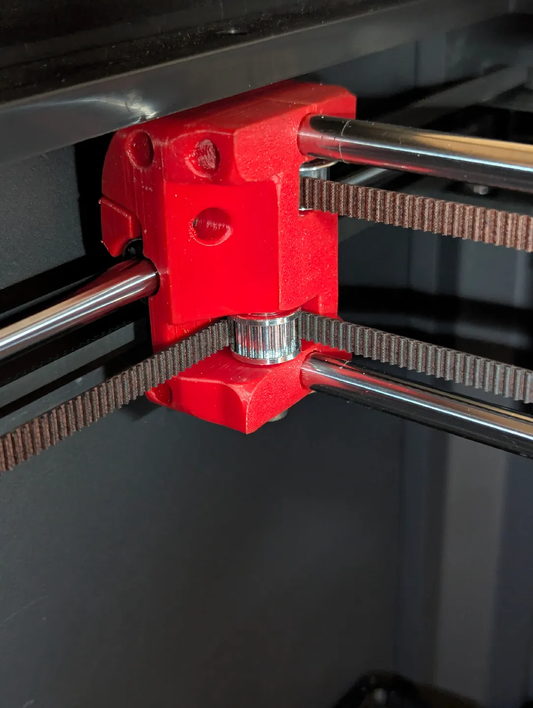{ width="225" } | |

    Replacement XY gantry idler blocks by [clogged\_nozz](https://www.printables.com/@clogged_nozz_2035917) compatible with both toothed and standard smooth idlers. Toothed idlers reduce belt pitch VFA and rattle at high accelerations; all variants allow belt and pulley service without disassembling the frame.

    [:octicons-arrow-right-24: Download on Printables](https://www.printables.com/model/1535090-centauri-carbon-runice-toothed-idler-blocks)

    ??? info "Details, BOM & Installation"

        #### Bill of Materials

        | Qty | Item | Link |
        |-----|------|------|
        | 2 | M4-D5-L25 shoulder screw | [AliExpress](https://aliexpress.com/item/1005008314676042.html) |
        | 2 | M4-D5-L50 shoulder screw | [AliExpress](https://aliexpress.com/item/1005008314676042.html) |
        | 2 | 20T 6(7)mm Runice toothed idler | [AliExpress\*](https://s.click.aliexpress.com/e/_olIajeK) |
        | 2 | 20T 6(7)mm Runice smooth idler | [AliExpress\*](https://s.click.aliexpress.com/e/_olIajeK) |
        | 4 | M3×12mm SHCS | [AliExpress](https://aliexpress.com/item/1005006869763828.html) |
        | 4 | M3×4L×5OD Voron-spec heatset insert | [AliExpress](https://aliexpress.com/item/1005006838108683.html) |
        | 6 | M6×10mm cup-point set screw | [AliExpress](https://aliexpress.com/item/4001081433504.html) |

        \* Affiliate link from SilencedFrost

        #### Print Settings

        | Setting | Value |
        |---------|-------|
        | Layer height | 0.2 mm (0.25 mm first layer) |
        | Walls | 3 minimum |
        | Wall generator | Arachne |
        | Seam position | Aligned |
        | Bridge orientation | 0° |
        | Orientation | Print as oriented |
        | Material | ASA or equivalent (avoid PETG — limits high-temp material printing) |

        !!! tip "Fiber-Filled Materials"
            When printing in fiber-filled materials, drill M3 holes to 3–3.2 mm and shoulder screw holes to 8 mm before assembly.

        !!! warning "Clamp Strength"
            Print the clamp as solid as possible — it carries significant mechanical load.

        #### Installation

        **1. Prepare blocks and clamps**

        Install the heatset inserts into the clamps.

        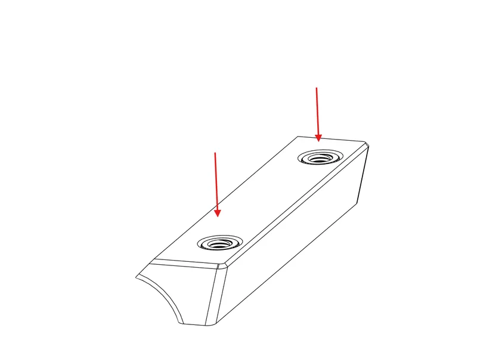{ width="500" }

        **2. Thread the set screws**

        Drive all set screws fully into the blocks to cut threads, then back them out so they won't contact the rods.

        !!! danger "Right Block — Bottom-Left Set Screw"
            **Do not thread the bottom-left set screw on the right block.** This will damage the damper and produce noise identical to the stock blocks.
            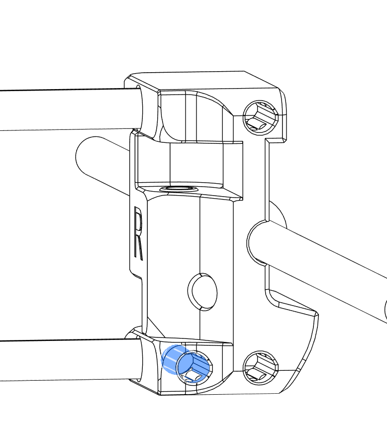{ width="500" }

        **3. Access the gantry**

        Follow the [Elegoo belt replacement guide](https://wiki.elegoo.com/Centauri-carbon/how-to-replace-the-timing-belt-of-the-print-head) through step 13, then continue below.

        **4. Remove belt tension**

        Remove the belt tensioners or fully loosen them. Remove the screws securing the bearing clamps.

        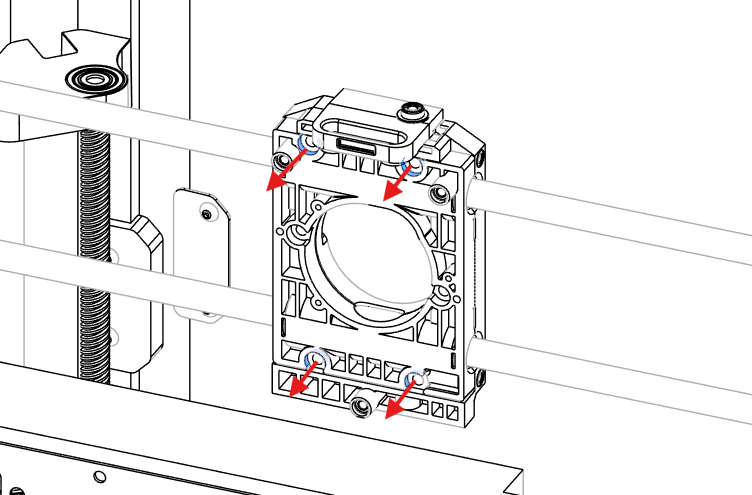{ width="500" }

        **5. Remove the belts**

        Pull the belts straight toward the rear of the printer.
        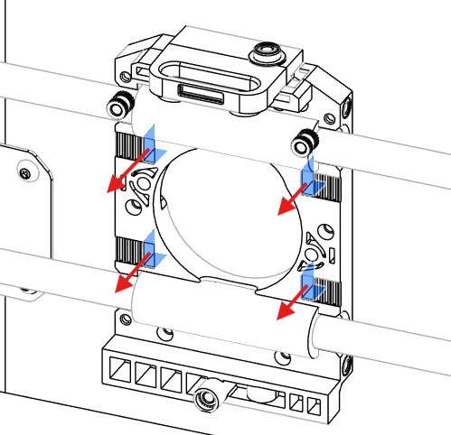{ width="500" }

        Remove the carriage and belts from the XY blocks. Do not feed the belt further than the XY blocks to ease reinstallation.

        **6. Remove side panels**

        Remove both side panels from the printer.

        **7. Remove stock XY block hardware**

        Remove the four M3×4mm BHCS from the stock XY blocks and lift off the bearing retaining plate.

        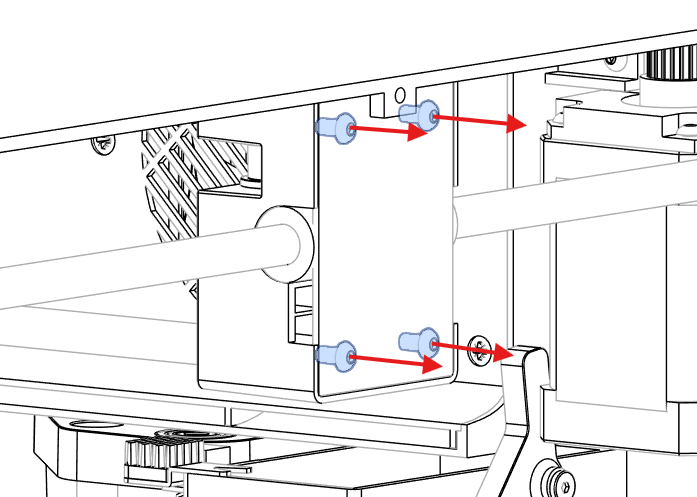{ width="500" }

        **8. Extract bearings**

        Gently slide each bearing out toward the rear — lightly pressing the block outward from the frame can help. Repeat on both sides.

        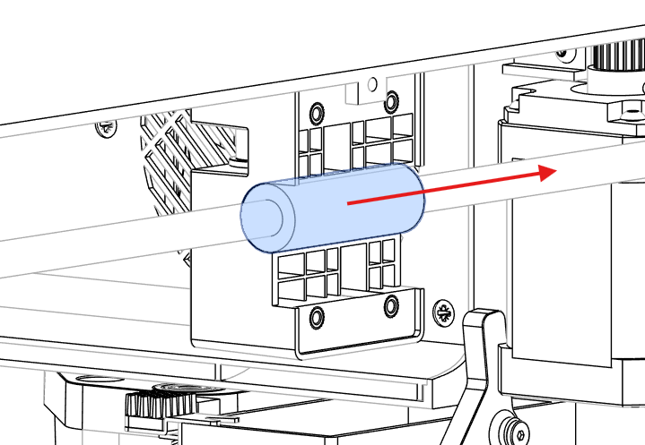{ width="500" }

        **9. Remove the gantry**

        Twist the X-axis gantry free and slide it out.

        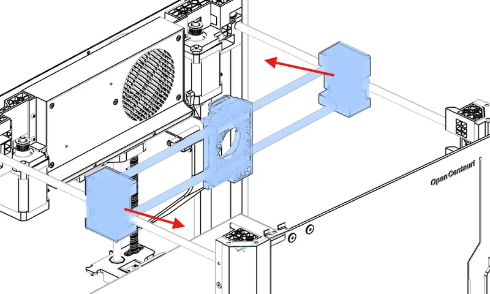{ width="500" }

        **10. Strip the old blocks**

        Remove all screws and plates from the stock XY blocks.

        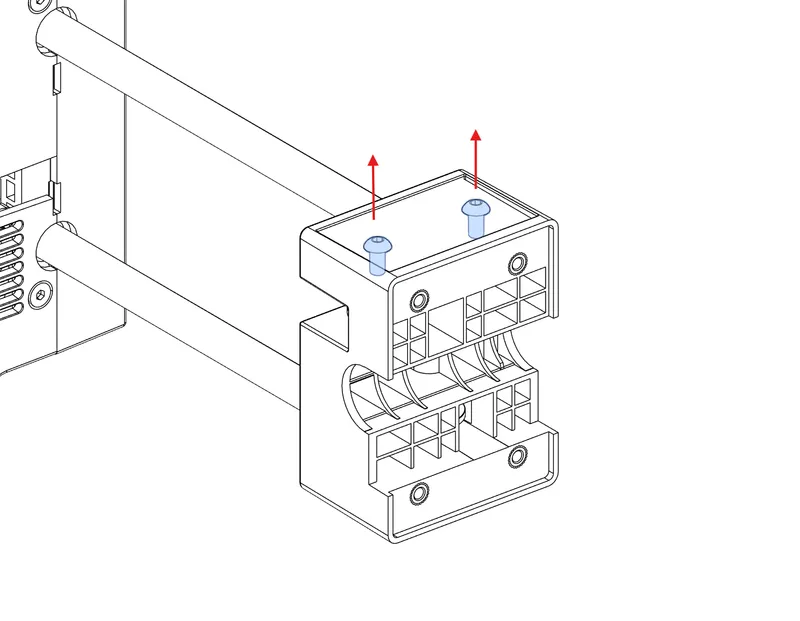{ width="500" }

        **11. Install new blocks**

        Slide a new block onto each rod, keeping the bearing on the rod at all times. Align one block so the rod end sits approximately flush with the outer M6 set screws, then tighten those set screws.

        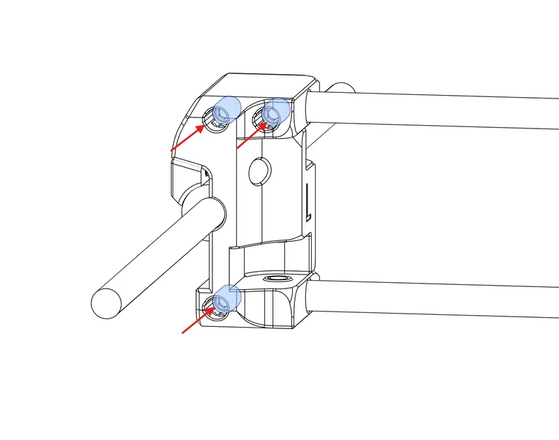{ width="500" }

        **12. Clamp and secure**

        Slide the second block inward until the rods protrude on one side. Mount each block on its bearing, slide on the clamp, and fasten with 2× M3×12mm SHCS. 

        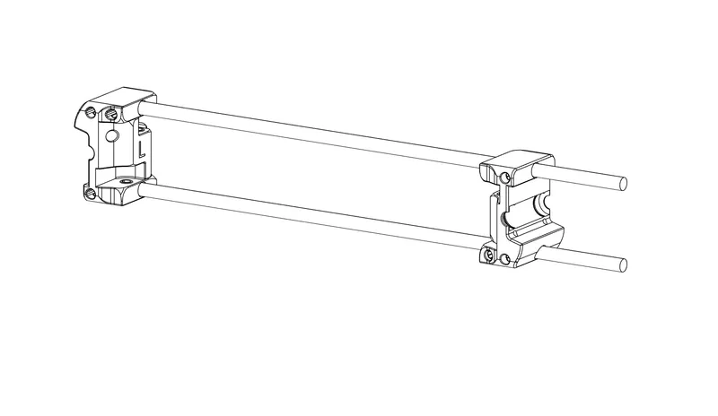{ width="500" }
        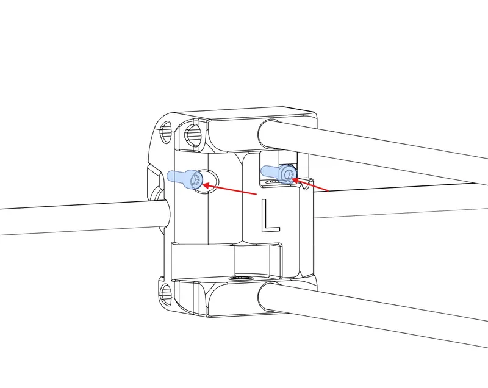{ width="500" }

        Shift the second block slightly along X to eliminate preload on the Y rods, then tighten its set screws.

        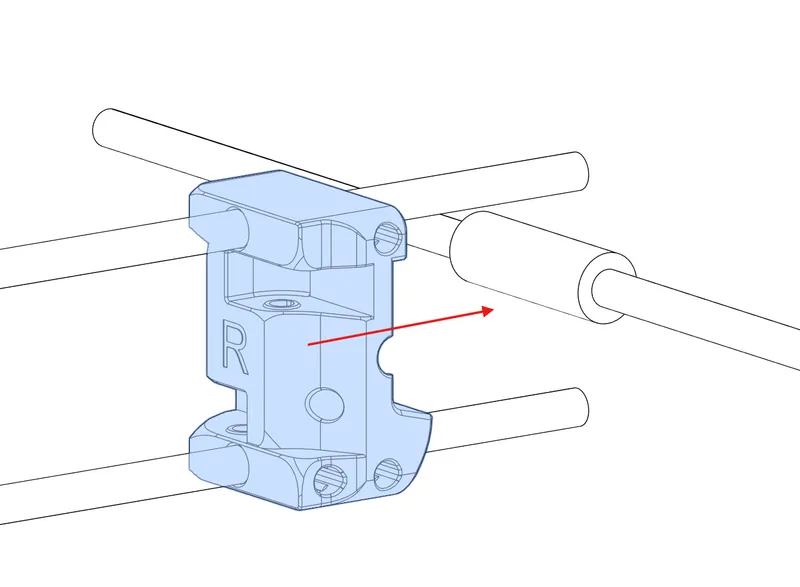{ width="500" }

        **13. Square the gantry**

        With bearings clamped and belts not yet installed, push the gantry forward. Both blocks should contact the frame simultaneously. Adjust set screws as needed to correct any angular offset.

        **14. Reinstall belts and pulleys**

        Route belts back through the toolhead, ensuring they are not reversed. Install front toothed idlers: left side with the 25 mm shoulder screw, right side with the 50 mm shoulder screw. Install rear smooth idlers with the opposite lengths. Do not overtighten — pulleys must spin freely.

        **15. Tension and verify**

        Tension the belts, run input shaper, and verify normal operation.

        !!! tip
            Check set screw tightness periodically for the first few prints and listen for any unusual sounds.

    ---

    ### Double Shear Motor Mounts

    | | |
    |:---:|:---:|
    | 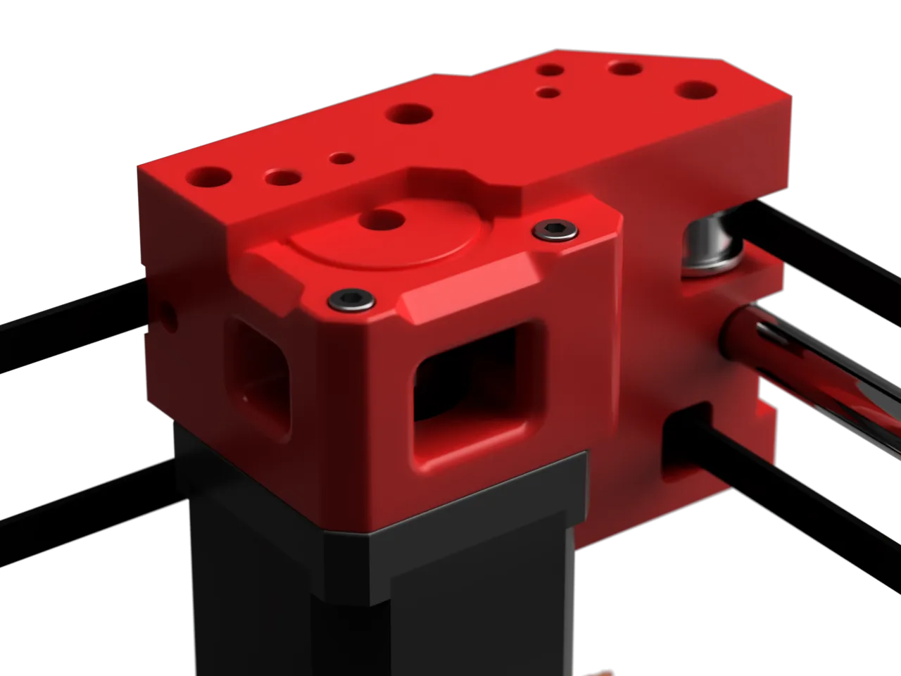{ width="370" } | 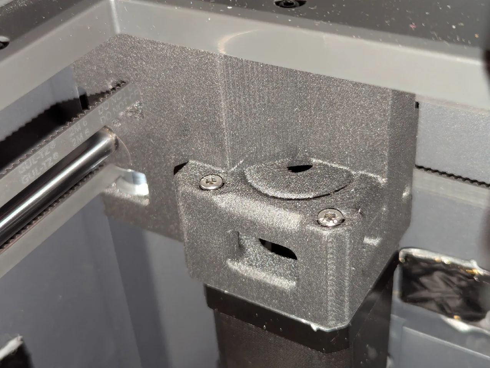{ width="370" } |

    Replacement Y-axis motor brackets by [clogged\_nozz](https://www.printables.com/@clogged_nozz_2035917) that constrain both ends of the stepper shaft, significantly stiffening the gantry and enabling higher belt tension for reduced ringing.

    [:octicons-arrow-right-24: Download on Printables](https://www.printables.com/model/1652075-centauri-carbon-double-shear-motor-mounts)

    !!! warning "Prerequisites"
        Requires [toothed idlers on the X gantry](#toothed-idler-blocks) to prevent belt damage at higher tension. Stepper motors must have a D-shaped shaft — source new NEMA 17 motors or grind the existing shaft flat and remove the pulley.

    ??? info "Details, BOM & Installation"

        **Benefits:**

        - Greater gantry stiffness at equivalent belt tension, due to both shaft ends being constrained
        - Ability to tension belts to full spec (requires shortening belts by ~3 teeth)
        - Eliminates risk of breaking the stepper motor shaft
        - Lower ringing from higher achievable belt tension
        - Reduced X-axis bearing rattle noise

        !!! note
            Supports stepper shafts up to 31 mm. 20 mm is the absolute minimum and is not recommended.

        #### Bill of Materials

        | Qty | Item | Link |
        |-----|------|------|
        | 14 | M3×4L×5OD heatset inserts | [AliExpress](https://aliexpress.com/item/1005006838108683.html) |
        | 2 | F695 bearings | [AliExpress](https://aliexpress.com/item/1005008876614749.html) |
        | 4 | M3×6 FHCS | [AliExpress](https://aliexpress.com/item/1005006860602257.html) |
        | 4 | M3×8 SHCS/BHCS | [AliExpress](https://aliexpress.com/item/1005006869763828.html) |
        | 4 | M3×30 SHCS/BHCS | [AliExpress](https://aliexpress.com/item/1005006869763828.html) |
        | 2 | 20T GT2 6mm drive pulley | [AliExpress\*](https://s.click.aliexpress.com/e/_oECuLOS) |
        | 4 | 20T GT2 6mm smooth idler | [AliExpress\*](https://s.click.aliexpress.com/e/_olIajeK) |
        | 4 | 5×20mm steel dowel pin | [AliExpress](https://aliexpress.com/item/1005003780227334.html) |

        \* Affiliate link from SilencedFrost

        #### Print Settings

        | Setting | Value |
        |---------|-------|
        | Walls | 5 |
        | Infill | 30% TPMS-D |
        | Infill lines | 2 multiline |
        | Supports | None |
        | Orientation | Print as oriented |
        | Material | ASA/ABS minimum — **PLA and PETG must not be used** (motors run hot; parts are under high sustained tension) |

        !!! tip "Annealing"
            If annealing the printed parts, install heatset inserts **before** the annealing step.

        #### Installation

        Disassembly is significant. Follow the [Elegoo linear bearing replacement guide](https://wiki.elegoo.com/Centauri-carbon/how-to-replace-the-x-axis-and-y-axis-linear-bearings) to expose the motor brackets, then install the new mounts.

        !!! note "Changelog"
            *V2 (2026-05-24): Widened idler mounting to accommodate Runice idlers.*
