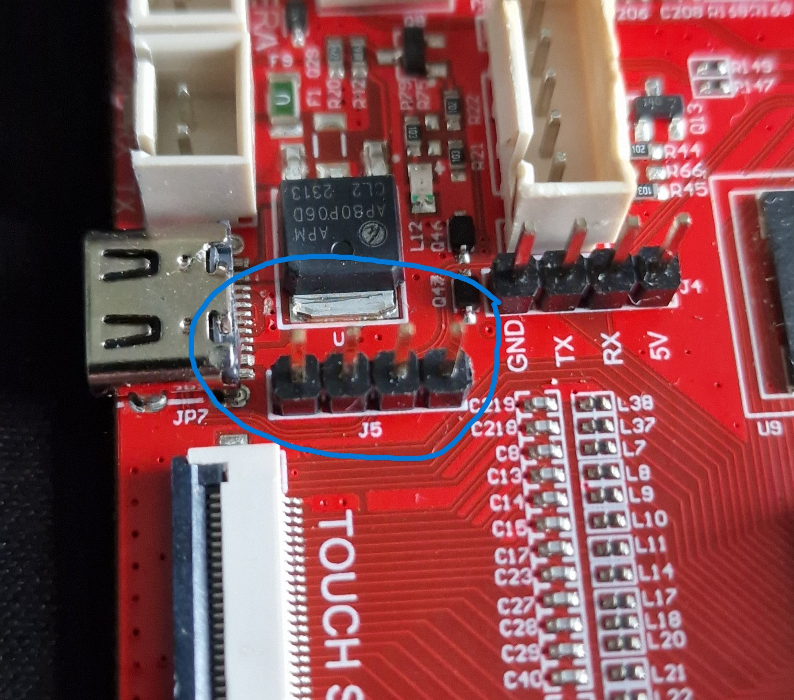
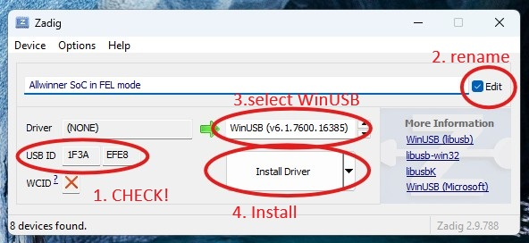

# Booting into Allwinner FEL mode

 
    **WARNING!!** Booting into FEL mode requires shorting out a resistor on the board. You can damage or kill your board if you're not careful!

## 1. solder the unpopulated usb header J5.
 { width="400" }

## 2. connect to to your computer
Connect the mainboard to your PC using a USB-A male to dupont female cable.\
The pinout of the dupont connectors is as follows:

| Pin NR | marking| Function | remarks |
|--|---|----|---|
| 1 | 5V | 5V | closest to the type-C connector|
| 2 | DP | DP | DP and DM are switched compared to standard usb c pinout |
| 3 | DM | DM |  |
| 4 | GND | GND ||

## 3. boot to FEL mode
 Press the reset button while shorting R53 with tweezers.
 the board should boot into FEL mode and connect to your PC

 ## 4. install driver

Use [Zadig](https://zadig.akeo.ie/) to install the  driver. 
- { width="400" }
1. Check the USB ID of the device. It has to be ``1F3A`` ``EFE8``.
2. rename the unknown device to a name of your choice by enabling "Edit"
3. Make sure the correct driver is selected: ``WinUSB``
4. Click the install button

## 5. recover your board/have fun
``WARNING!!! Making mistakes while in FEL mode CAN break your board! Be careful! ``\
Now you can connect to the board