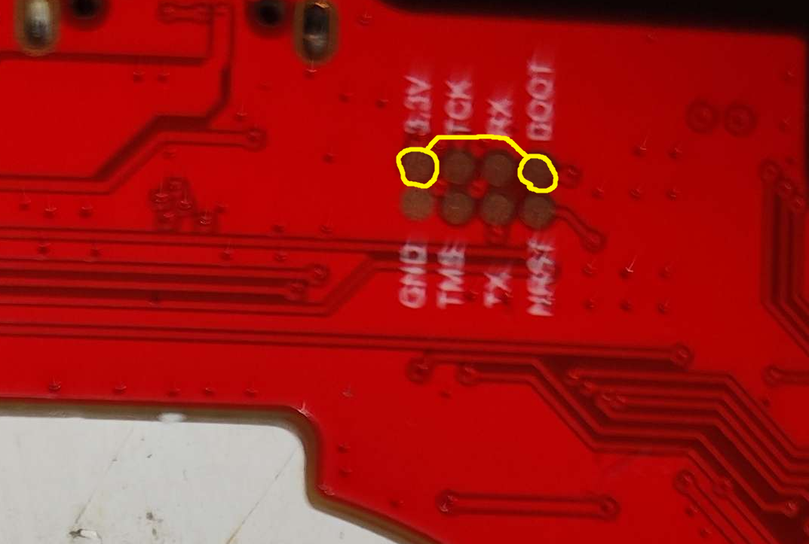
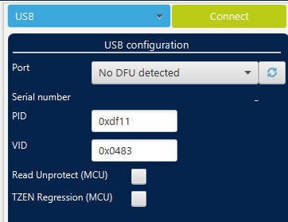
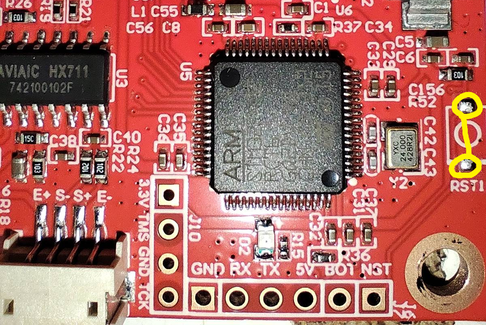
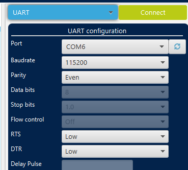

The CC uses two different embedded firmware for the bed and the hotend boards with allegedly the same bootloader. The firmwares as of 2025-05-19 are a substitute of Klipper commit `28f60f7e` with a lot of changes.

# Official update method

To update both the hotend and the bed boards, the main firmware attempts to send a file through YModem protocol when the said boards are power cycled during bootup. The firmware files are not encrypted and are stored
on the `rootfsA` or `rootfsB` partition (whichever is active) in the `/lib/firmware` folder. The hotend firmware is called `upgrade-hotend.bin` and the bed board's is `upgrade-bed.bin`.

# STM32 flash structure

```
| 0x08000000.......0x08007FFF | 0x08008000.......0x0800BFFF | 0x0800C000.......
|       32Kb Bootloader       |          16Kb Unknown       |     Elegoo-Klipper Firmware
```

The firmware upgrade files include the 16Kb of unknown (mostly 0xFF with some random bytes) data so it must be flashed on address `0x08008000`.

# Flashing custom firmware (READ THE NOTE)

### **! IMPORTANT NOTE !**

**Doing so will ERASE THE ELEGOO BOOTLOADER that we have no image file for, nor a substitution**

**Currently the stock Mainboard can NOT boot from custom firmwares nor the stock firmware without the original
bootloader. Nobody in the OpenCentauri community holds responsibility of any bricked or damaged machine.
Anything you do is your own responsibility!**

### ReadOut Protection

The hotend and bed boards come with the readout protection enabled by default. As long as you don't remove it, the stock flash is safe. If you instruct the programmer to deactivate the readout protection, the entire flash memory, with the bootloader and the firmware will be wiped.

### Hotend

1. Remove the hotend board (only the main one, the supplementary board is not needed).
1. On the back side, there is a 2x4 copper pad row. Short the `3.3v` and the `BOOT` with a tweezer
{ width="400" }
1. Connect it to your PC via an USB-C cable (no adapter is needed) while shorting the pins
1. Keep it shorted for ~2 seconds, then you can let go
1. Open STM32CubeProgrammer software
1. On the top right, select the USB mode and if you shorted the pins correctly, it should find
the hotend board. if not, you'll get a "No DFU detected".
{ width="400" }
1. Go to the second tab in the left side vertical button column
1. In the "Download" section, select the firmware file.
1. Click `Start Programming`

### Bed

1. Either via an added connector or solder jumper wires directly to the right side serial pins to an USB-TTL transciever as

|Bed Board|USB-TTL|
|--|--|
|5v|5v|
|RX|RX|
|TX|TX|
|GND|GND|

Note: Depending on the USB-TTL board, RX and TX lines might need to be switched.

2. Short the `BOOT` pin to `3.3v`
{ width="400" }

3. Connect the USB-TTL board to your PC

4. Short the `RESET` pins on the bed board (no need to keep it shorted, just touch it)
{ width="400" }

5. In STM32CubeProgrammer, select UART mode and select your USB-TTL device
{ width="400" }

6. Go to the second tab in the left side vertical button column
7. In the "Download" section, select the firmware file.
8. Click `Start Programming`

# Firmware Creation

The STM32F402 is an STM32 variant specifically made for the Chinese market. For any configuration, use STM32F401RTC6 (sometimes just STM32F401).

### Vanilla Klipper and/or custom firmware

Select "No bootloader" in the `make menuconfig` and flash it to the default address. If you plan to use the stock bootloader and/or a similar size, select 32Kb bootloader and flash to default address + `0x8000`.

#### Communication interfaces

|Board|Pins|
|--|--|
|Hotend|USB PA11 / PA12|
|Bed (stock RS232 transciever)|UART PA2 / PA3|
|Bed (right side serial)| UART1 PA9 / PA10|

### Boostrapping the stock firmware

You need to find a bootloader either source code or image. Then you need to merge it with the Elegoo firmware into one file, with the following format:

```
| 0x0 ....................... 0x7FFF | 0x8000 .......
|   Bootloader, padded with 0x00     |       Stock firmware file
```

And flash the merged file to the default address.

**AGAIN: Even flashing back the stock firmware will brick the stock mainboard in a boot hang. We are trying to figure out what is the cause of it! We hold no responsibility of any damage!**