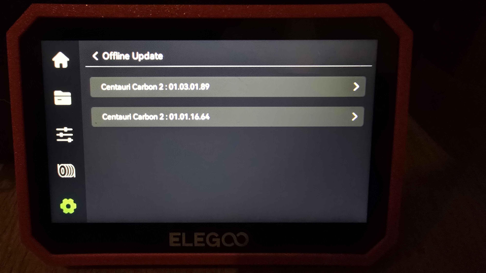
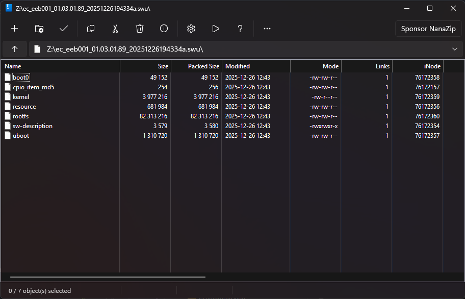

# CC2 update archive

## Updating locally (via USB)

1. Download a firmware from the [Firmware update archive](#firmware-update-archive) section.
2. Plug in a USB thumb drive and place the downloaded file in the root directory of the USB drive.
    - You do not need to decrypt/unpack this update. Place the `.zip.sig` file on the USB.
3. Plug the USB thumb drive into the Centauri Carbon 2.
4. Navigate to Settings, `Check for Updates`, `Offline Update`, and select the downloaded update.

{ width="400" }
/// caption
Credit to foggingweeb on the OpenCentauri Discord.
///

## Decrypting & Unpacking updates

*Note: This is for firmware research only*

The Centauri Carbon 2 delivers updates in a `.zip.sig` format. The `.sig` layer appears to be an encryption and metadata wrapper. Inside the zip, two files can be found:

- `*.swu.sig`: The update package.
- `*.json.sig`: Metadata information (such as version details) about other files in the zip.

??? "Online Firmware unpacker"
    <iframe src="/extras/cc2_update_decrypt.html" width="100%" height="500"></iframe>

{ width="400" }
/// caption
Credit to Sims on the OpenCentauri Discord.
///

The Centauri Carbon 2 employs an A/B partition scheme managed by `swupdate`. Updates are written to the inactive slot, which then becomes the primary boot partition upon the next restart.

## Firmware update archive

### v02.00.02.00 (Released 28/05/2026)
[Download](https://github.com/suchmememanyskill/cc2-firmwares/raw/refs/heads/main/cc2-02.00.02.00-a3a76f4eb7036027e0927d7f9184a092-release-abroad.zip.sig){  referrerpolicy="no-referrer" .md-button .md-button--primary }

??? warning "SSH disabled"
    This release removes the SSH process entirely, making it more difficult to perform research on a live device.

??? warning "Downgrades disabled"
    This release prevents downgrades to any version before this release. If you'd like to downgrade anyway, use the repacked version of v01.03.02.51 below. Use at your own risk.

    [Download repacked v01.03.02.51](https://github.com/suchmememanyskill/cc2-firmwares/raw/refs/heads/main/cc2_eeb001_02.00.00.00_from51.zip.sig){  referrerpolicy="no-referrer" .md-button .md-button--primary }

Changelog:

1. Implemented several UI adjustments.
1. Added weak network reminder for Wi-Fi connections.
1. Fixed occasional Error 803 triggered by heating commands.
1. Fixed the occasional mismatch between timelapse video filenames and print file 
1. filenames during export.
1. Fixed the issue where resume printing failed after power loss when using an external spool under certain conditions.

### v01.03.02.51 (Released 09/05/2026)
[Download](https://github.com/suchmememanyskill/cc2-firmwares/raw/refs/heads/main/cc2-01.03.02.51-2ab3ffd72854dfd40af180c57fb9bb31-release-abroad.zip.sig){  referrerpolicy="no-referrer" .md-button .md-button--primary }

Changelog:

1. Added the ability to exclude and reset regions containing foreign objects.
1. Enhanced handling of LAN file upload errors.
1. Fixed display issues in UI.
1. Fixed an issue where a 1252 error would cause pop-up dialogs to get stuck, even when the system was idle.
1. Fixed a bug where print history showed a total print time of 0 after resuming printing following a power outage.

### v01.03.02.36 (Released 09/04/2026)
[Download](https://github.com/suchmememanyskill/cc2-firmwares/raw/refs/heads/main/cc2-01.03.02.36-ee76546c665bb272b43798813f60f8dd-release-abroad.zip.sig){  referrerpolicy="no-referrer" .md-button .md-button--primary }

Changelog:

1. Improved stability during device network connection and account binding process.
1. Updated built-in filament parameters.
1. Optimized print recovery quality after pause/resume.
1. Enhanced error dialog logic for better user experience.
1. Improved file switching smoothness when using USB drives.
1. Fixed occasional 803 error that occurred in certain usage scenarios.
1. Resolved intermittent "Printer Busy" issue after file upload.

### v01.03.01.89 (Released 09/01/2026)
[Download](https://github.com/suchmememanyskill/cc2-firmwares/raw/refs/heads/main/cc2-01.03.01.89-18d82e89afe354a5801102751e838fcb-release-abroad.zip.sig){  referrerpolicy="no-referrer" .md-button .md-button--primary }

Changelog:

1. Added ELEGOO Matrix APP binding function (APP requires v1.0.11 or later)
2. Added ElegooSlicer binding function (requires v1.3.0.11 or later)
3. Optimized occasional screen flickering during LAN video streaming
4. Optimized filament breakage handling during multi-color printing
5. Enhanced CANVAS plug/unplug handling during printing
6. Fixed abnormal settings and reset issues in filament selection
7. Fixed occasional WiFi disconnection

### v01.01.16.64 (Released 11/12/2025)
[Download](https://github.com/suchmememanyskill/cc2-firmwares/raw/refs/heads/main/cc2-01.01.16.64-0e8e05b1a71e193e1cf428db7280c664-release-abroad.zip.sig){  referrerpolicy="no-referrer" .md-button .md-button--primary }

Changelog:

1. Optimized the process of material feeding and unloading
2. Optimized the flushing process during material change
3. Adjusted the material exhaustion handling process in multi-color mode
4. Added material breakage alarm function
5. Added screen off after 25 minutes option
6. Fixed the issue with abnormal cavity temperature alarm
7. Fixed the problem of incomplete material display
8. Improved the stability of connection with slicing soft

### v01.01.16.40 (Released 17/11/2025)
[Download](https://github.com/suchmememanyskill/cc2-firmwares/raw/refs/heads/main/cc2-01.01.16.40-3b88c664cbd7e5a29bcd44868321971d-release-abroad.zip.sig){  referrerpolicy="no-referrer" .md-button .md-button--primary }

Changelog:

1. Optimized the retry mechanism for feeding failures under CANVAS
2. Fixed the issue where the tool head consumable detection failed to trigger under certain conditions
3. Resolved the abnormal triggering count issue of filament entanglement detection
4. Fixed the abnormal display issue during Wi-Fi search
5. Adjusted the RFID recognition status to avoid detection during self-check
6. Fixed the file display abnormality issue
7. Added multi-language display support

### v01.01.16.21 (Released 31/10/2025)
[Download](https://github.com/suchmememanyskill/cc2-firmwares/raw/refs/heads/main/cc2-01.01.16.21-a20c212081d7287869bf094cb1522106-release-abroad.zip.sig){  referrerpolicy="no-referrer" .md-button .md-button--primary }